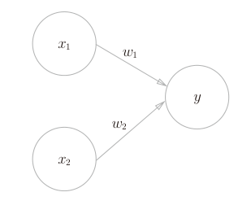

# 定义


$$
y = 
\begin{equation}
\begin{cases}
0\quad(w_1x_1+w_2x_2)\leq\theta\\
1\quad(w_1x_1+w_2x_2)\gt\theta
\end{cases}
\end{equation}
$$
输入算上权重，当总和超过阈值，就会输出1

# 简单逻辑电路

## 简单的实现

**与门（AND gate）**

只有两输入都是1输出才是1

| $x_1$ | $x_2$ | $y$  |
| ----- | ----- | ---- |
| 0     | 0     | 0    |
| 1     | 0     | 0    |
| 0     | 1     | 0    |
| 1     | 1     | 1    |

比如$(w_1,w_2,\theta)=(0.5,0.5,0.7)$


**与非门（NAND gate）**

两输入同时为1输出为0，其余都是1

| $x_1$ | $x_2$ | $y$  |
| ----- | ----- | ---- |
| 0     | 0     | 1    |
| 1     | 0     | 1    |
| 0     | 1     | 1    |
| 1     | 1     | 0    |

比如$(w_1,w_2,\theta)=(-0.5,-0.5,-0.7)$


**或门（OR gate）**

只要有1个输入是1，输出就是1

| $x_1$ | $x_2$ | $y$  |
| ----- | ----- | ---- |
| 0     | 0     | 0    |
| 1     | 0     | 1    |
| 0     | 1     | 1    |
| 1     | 1     | 1    |

> 我们看着真值表这种“训练数据”，人工考虑（想到）了参数的值。而机器学习的课
> 题就是将这个决定参数值的工作交由计算机自动进行。**学习**是确定合适的参数的过程，而人要做的是思考感知机的构造（模型），并把训练数据交给计算机。

用python实现就是

```python
def AND(x1, x2):
    w1, w2, theta = 0.5, 0.5, 0.7
    tmp = x1*w1 + x2*w2
    if tmp <= theta:
        return 0
    elif tmp > theta:
        return 1


print(AND(0, 0))
print(AND(1, 0))
print(AND(0, 1))
print(AND(1, 1))
```


## 权重和偏置

$$
y = 
\begin{equation}
\begin{cases}
0\quad(b+w_1x_1+w_2x_2)\leq0\\
1\quad(b+w_1x_1+w_2x_2)\gt0
\end{cases}
\end{equation}
$$

将阈值移到不等式左边，这里的$b$就是偏置，$w_1$和$w_2$是权重，最后和0比较

用python其实就是简单修改一下

```python
import numpy as np


def AND(x1, x2):
    x = np.array([x1, x2])
    w = np.array([0.5, 0.5])
    b = -0.7
    tmp = np.sum(x*w)+b
    if tmp <= 0:
        return 0
    elif tmp > 0:
        return 1


def NAND(x1, x2):
    x = np.array([x1, x2])
    w = np.array([-0.5, -0.5])
    b = 0.7
    tmp = np.sum(x*w)+b
    if tmp <= 0:
        return 0
    elif tmp > 0:
        return 1

def OR(x1,x2):
    x = np.array([x1, x2])
    w = np.array([0.5, 0.5])
    b = -0.2
    tmp = np.sum(x*w)+b
    if tmp <= 0:
        return 0
    elif tmp > 0:
        return 1
```

## 感知机的局限性

异或门（XOR gate）

只有输入一方为1时才会输出1

| $x_1$ | $x_2$ | $y$  |
| ----- | ----- | ---- |
| 0     | 0     | 0    |
| 1     | 0     | 1    |
| 0     | 1     | 1    |
| 1     | 1     | 0    |

前面的感知机是无法实现的，除非这样分割成一个非线性空间


## 多层感知机

事实上其实只要把前面其中的两个结合起来一起使用就可以实现异或门的功能


我的想法是与非门和或门一起使用，然后输出给与门，你看这样与非门的结果是1110，或门的结果是0111，然后输入到与门就是0110，实现了异或门。


| $x_1$ | $x_2$ | $s_1$ | $s_2$ | y    |
| ----- | ----- | ----- | ----- | ---- |
| 0     | 0     | 1     | 0     | 0    |
| 1     | 0     | 1     | 1     | 1    |
| 0     | 1     | 1     | 1     | 1    |
| 1     | 1     | 0     | 1     | 0    |

接着咱们可以用python实现一下。

```python
def XOR(x1, x2):
    s1 = NAND(x1, x2)
    s2 = OR(x1, x2)
    y = AND(s1, s2)
    return y


print(XOR(0, 0))
print(XOR(1, 0))
print(XOR(0, 1))
print(XOR(1, 1))
```

这就已经实现了多层感知机了


> 有的根据权重来，认为是2层感知机，但是有的认为是3层感知机

> 单层感知机无法表示的东西，通过增加一层就可以解决

# 感知机的延伸

多层感知机甚至可以实现更复杂的电路。比如加法器，二进制转十进制的编码器，甚至感知机可以表示计算机。理论上两层感知机就可以（激活函数使用非线性sigmoid函数）。但是多层叠加会更自然一些。
