# 从感知机到神经网络

神经网络的重要性质就是可以自动从数据中学习到合适的权重参数。

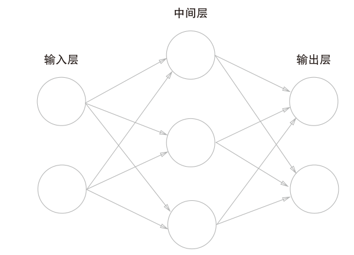

输入层，中间层（隐藏层），输出层

先来复习一下感知机，如果算上偏置，然后简化为一个函数，就可以写成
$$
y = 
\begin{equation}
\begin{cases}
0\quad(b+w_1x_1+w_2x_2)\leq0\\
1\quad(b+w_1x_1+w_2x_2)\gt0
\end{cases}
\end{equation}
$$

$$
y=h(b+w_1x_1+w_2x_2) \\
h(x)=
\begin{equation}
\begin{cases}
0\quad{(x\leq0)}\\
1\quad{(x\gt0)}
\end{cases}
\end{equation}
$$
输入信号总会被$h(x)$转换，转换后的值就是y

然后画成

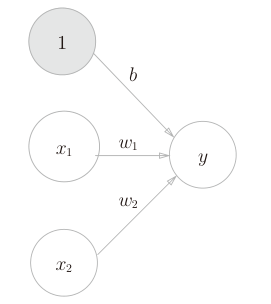

偏置的输入就一直是1的，画成灰色以便与其他输入区分。

此时$h(x)$将输入信号的总和转换为输出信号，这样的函数就是激活函数

写的复杂一点那就是
$$
a=b+w_1x_1+w_2x_2\\
y=h(a)
$$
表示激活函数的计算过程

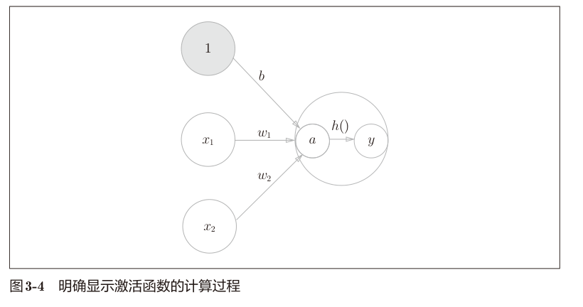

# 激活函数

## 阶跃函数与sigmoid函数

非0即1这样的激活函数一般叫他**阶跃函数**（一旦输入超过阈值，就切换输出）

可以说感知机使用了阶跃函数作为激活函数。当这个激活函数从阶跃函数变成其他函数，那就是神经网络了。

**sigmoid函数**
$$
h(x)=\frac{1}{1+\exp{(-x)}}=\frac{1}{1+e^{-x}}
$$

> sigmoid函数看上去有些复杂，但它也仅仅是个函数而已。而函数就是给定某个输入后，会返回某个输出的转换器。

接下来就用python实现一下阶跃函数和sigmoid函数的写法和图形。

```python
import numpy as np
import matplotlib.pyplot as plt

def step_function(x):
    return np.array(x > 0, dtype=np.int32)  # 已经没有np.int这个了


x = np.arange(-5, 5, 0.1)
y = step_function(x)
plt.plot(x, y)
plt.ylim(-0.1, 1.1)  # 指定y轴的范围
plt.show()
```

这个是阶跃函数，似乎已经没有原文说的`np.int`了，我就随便替代了一个

```python
def sigmoid(x):
    return 1/(1+np.exp(-x))


x = np.arange(-5, 5, 0.1)
y = sigmoid(x)
plt.plot(x, y)
plt.ylim(-0.1, 1.1)  # 指定y轴的范围
plt.show()
```

> 反正有AI，画在一起也不是难事

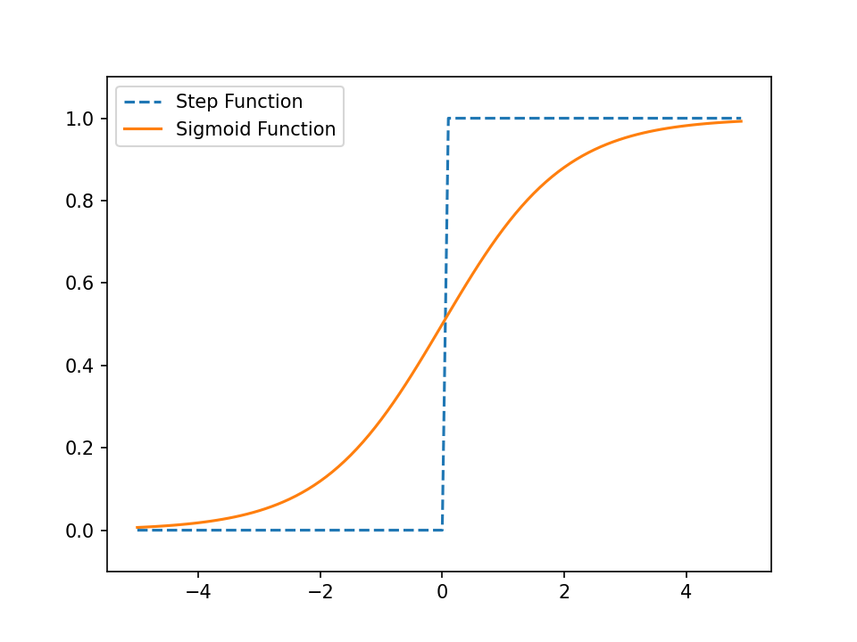

对两个函数进行比较，可以看出sigmoid函数更加平滑一点。而阶跃函数在0附近剧烈变化。相同点就是输入越大输出越大（靠近1）

另外一个共同点是**非线性函数**，神经网络的输出必须得是非线性函数，如果是线性函数就神经网络的层数就没有意义了。

> 常见的线性函数是$h(x)=cx$这种输出是输入的常数倍
>
> 如果加层数，也无非是$h(x)=c_1c_2c_3\cdots{}c_nx=ax$都是无效层数

## ReLU函数

英文是Rectified Linear Unit，线性整流函数。输入大于0时，直接输出；小于等于0，输出是0。
$$
h(x)=
\begin{equation}
\begin{cases}
x\quad{(x\gt0)}\\
0\quad{(x\leq0)}
\end{cases}
\end{equation}
$$
写起来也很简单，只要取和0的最大值即可

```python
def relu(x):
    return np.maximum(0, x)


x = np.arange(-5, 5, 0.1)
y = relu(x)
plt.plot(x, y)
plt.ylim(-1, 6)  # 指定y轴的范围
plt.show()
```

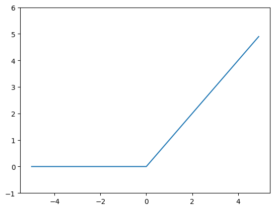

# 多维数组

## 矩阵乘法

来复习一下矩阵的乘法运算

先是一维数组

```python
import numpy as np
A = np.array([1, 2, 3, 4])
print(A)
#[1 2 3 4]
np.ndim(A)
#1
A.shape
#(4,)
A.shape[0]
#4
```

再来看看二维数组，有行有列，是个矩阵

```python
B=np.array([[1,2],[3,4],[5,6]])
print(B)
'''
[[1 2]
 [3 4]
 [5 6]]
 '''
np.ndim(B)
#2
B.shape
#(3, 2)
```

矩阵乘法，这里就不多介绍了，还好我反复学过好几次的线性代数（半途而废了）

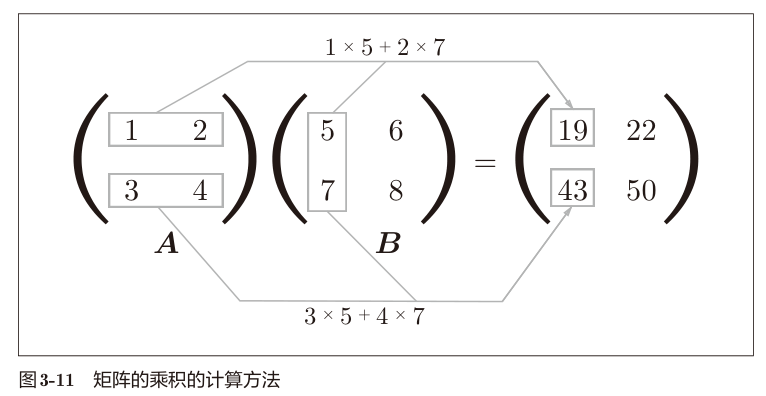

在python中运算一下，两个方阵，还有两个不是方阵的

```python
A=np.array([[1,2],[3,4]])
B=np.array([[5,6],[7,8]])
np.dot(A,B)
'''
array([[19, 22],
       [43, 50]])
'''

A=np.array([[1,2,3],[4,5,6]])
B=np.array([[1,2],[3,4],[5,6]])
np.dot(A,B)
'''
array([[22, 28],
       [49, 64]])
'''

A=np.array([[1,2],[3,4],[5,6]])
B=np.array([7,8])
np.dot(A,B)
'''
array([23, 53, 83])
'''
```

如果不满足矩阵乘法，A列数和B行数相等，那就会报错了。

> 不知道为什么这里神经网络要用内积这个词语。感觉在矩阵中内积指的好像都是对应元素相乘来着。

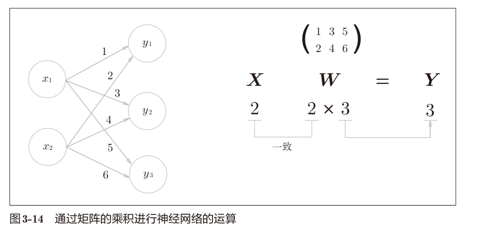

注意X,W,Y的形状和对应的元素

```python
X=np.array([1,2])
W=np.array([[1,3,5],[2,4,6]])
Y=np.dot(X,W)
print(Y)
```

似乎中间层的矩阵形状是（输入数，该层神经元数）

## 3层神经网络的实现

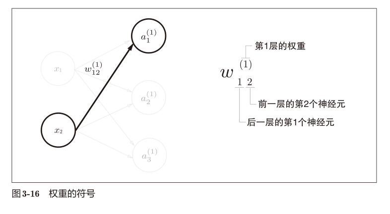

符号的表示

权重的右下角表明了第几个到第几个，右上角说的是去第几层

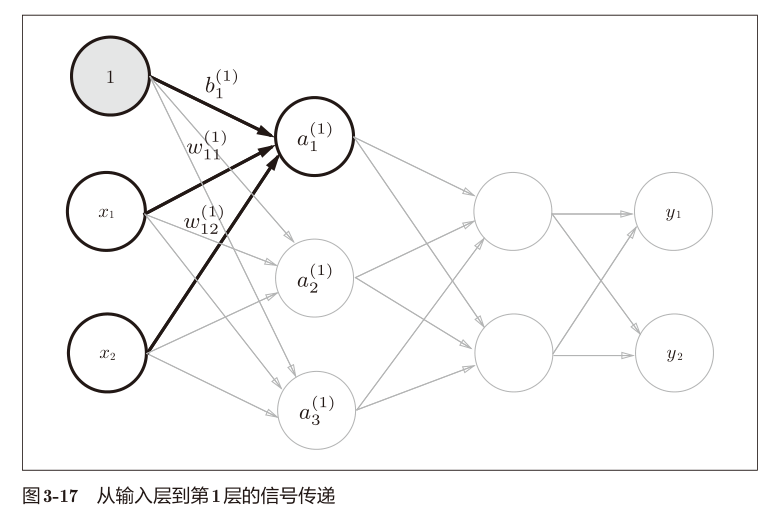

第1层第1个神经元
$$
a_1^{(1)}=w_{11}^{(1)}x_1+w_{12}^{(1)}x_2+b_1^{(1)}
$$
那第1层用矩阵就可以写成
$$
A^{(1)}=XW^{(1)}+B
$$
其中
$$
A^{(1)}=(a_1^{(1)}\quad{}a_2^{(1)}\quad{}a_3^{(1)})\\
X=(x_1\quad{}x_2)\\
B^{(1)}=(b_1^{(1)}\quad{}b_2^{(1)}\quad{}b_3^{(1)})\\
W^{(1)}=
\left(
\begin{array}{l}
w_{11}^{(1)} & w_{21}^{(1)} & w_{31}^{(1)}\\
w_{12}^{(1)} & w_{22}^{(1)} & w_{32}^{(1)}
\end{array}
\right)
$$
用python写一下，随便设置一些值。

```python
import numpy as np


# sigmoid函数
def sigmoid(x):
    return 1/(1+np.exp(-x))


# 多维数组
X = np.array([1, 0.5])
W1 = np.array([[0.1, 0.3, 0.5], [0.2, 0.4, 0.6]])
B1 = np.array([0.1, 0.2, 0.3])

print(X.shape)
print(W1.shape)
print(B1.shape)

A1 = np.dot(X, W1) + B1
Z1 = sigmoid(A1)

print(A1)
print(Z1)
```

直接把激活函数也加进这个过程了。

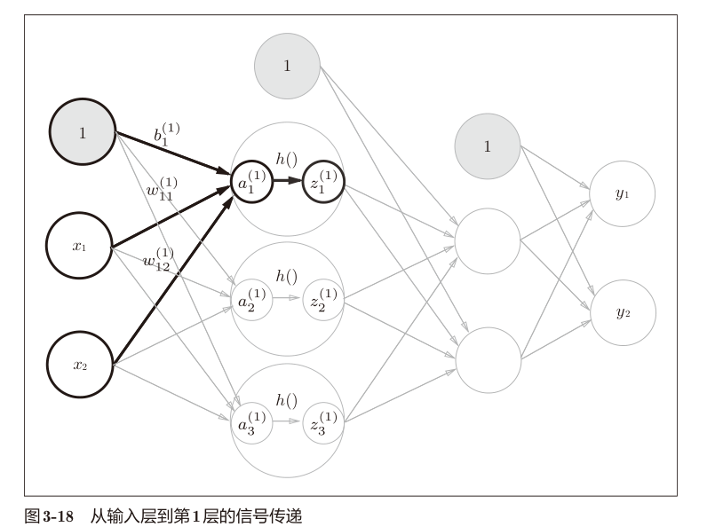

第1层到第2层

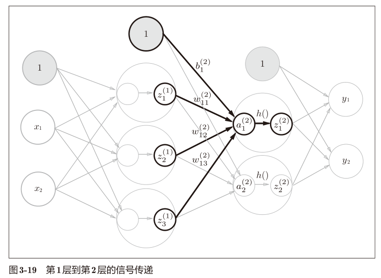

```python
W2 = np.array([[0.1, 0.4], [0.2, 0.5], [0.3, 0.6]])
B2 = np.array([0.1, 0.2])

print(Z1.shape)
print(W2.shape)
print(B2.shape)

A2 = np.dot(Z1, W2) + B2
Z2 = sigmoid(A2)

print(A2)
print(Z2)
```

第2层到输出层

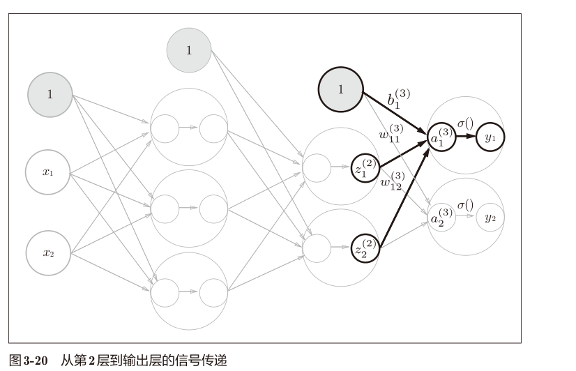

```python
#恒等函数
def identity_function(x):
    return x

W3 = np.array([[0.1, 0.3], [0.2, 0.4]])
B3 = np.array([0.1, 0.2])

A3 = np.dot(Z2, W3) + B3
Y = identity_function(A3)

print(A3)
print(Y)
```

之所以要定义一个恒等函数，是为了和前面的流程保持一致，只是按照原样进行输出罢了。不用其实也不影响结果。一般输出层的激活函数用$\sigma()$表示。

> 输出层所用的激活函数，要根据求解问题的性质决定。一般地，回归问题可以使用恒等函数，二元分类问题可以使用sigmoid函数，多元分类问题可以使用softmax函数。

整理起来就是

```python
import numpy as np


def sigmoid(x):
    return 1/(1+np.exp(-x))


def identity_function(x):
    return x


def init_network():
    network = {}
    network['W1'] = np.array([[0.1, 0.3, 0.5], [0.2, 0.4, 0.6]])
    network['b1'] = np.array([0.1, 0.2, 0.3])
    network['W2'] = np.array([[0.1, 0.4], [0.2, 0.5], [0.3, 0.6]])
    network['b2'] = np.array([0.1, 0.2])
    network['W3'] = np.array([[0.1, 0.3], [0.2, 0.4]])
    network['b3'] = np.array([0.1, 0.2])
    return network


def forward(network, x):
    W1, W2, W3 = network['W1'], network['W2'], network['W3']
    b1, b2, b3 = network['b1'], network['b2'], network['b3']

    a1 = np.dot(x, W1) + b1
    z1 = sigmoid(a1)
    a2 = np.dot(z1, W2) + b2
    z2 = sigmoid(a2)
    a3 = np.dot(z2, W3) + b3
    y = identity_function(a3)
    return y


network = init_network()
x = np.array([1.0, 0.5])
y = forward(network, x)
print(y)
```

这样写起来的确是很简洁，并且复用性很好。

这里定义了 `init_network()` 用来进行权重和偏置的初始化。forward则是前向的概念，指的是从输入到输出方向的传递处理。后面还会有backward（后向）的概念。

# 输出层的设计

## softmax函数

根据实际问题选择输出层的激活函数$\sigma()$

一般认为回归用恒等函数，分类用softmax函数。


恒等函数就原封不动地输出。

分类问题用的softmax函数：
$$
y_k=\frac{\exp{(a_k)}}{\displaystyle\sum^n_{i=1}(a_i)}
$$
输出层有$n$有个神经元，计算第k个神经元的输出 $y_k$。

分子式输入信号$a_k$的指数函数，分子是所有输入信号的指数函数的和。


用python实现一下softmax函数

```python
def softmax(a):
    exp_a = np.exp(a)
    sum_exp_a = np.sum(exp_a)
    y = exp_a / sum_exp_a
    return y
```

一个问题就是指数运算容易变得非常大，$e^{1000}$已经是 `inf`无穷大了

> 数值必须在4字节或8字节有限数据宽度内，超大值无法表示，称之为溢出。

但是可以进行改进，相当于分子分母都乘$\text{C}$这个常数，然后移动到指数函数里面，最后改为$\text{C}^\prime$
$$
\begin{aligned}
y_k=\frac{\exp{(a_k)}}{\displaystyle\sum^n_{i=1}(a_i)}&=\frac{\text{C}\exp{(a_k)}}{\text{C}\displaystyle\sum^n_{i=1}(a_i)}\\
&=\frac{\exp{(a_k+\log\text{C})))}}{\displaystyle\sum^n_{i=1}(a_i+\log\text{C})}\\
&=\frac{\exp{(a_k+\text{C}^{\prime})}}{\displaystyle\sum^n_{i=1}(a_i+\text{C}^{\prime})}
\end{aligned}
$$
所以这里$\text{C}^\prime$其实可以取任何值，为了防止溢出，一般都会使用输入信号中的最大值。

不难看出，softmax得到输出总和是1，正是因为这个性质，可以将输出解释为“概率”

另外就是输出的元素之间大小关系不变，因为softmax也是单调递增的函数。

所以在实际使用中，softmax函数不会改变最大神经元的位置，输出层的softmax函数会被省略，实际运算也会被省略。因为分类任务只要求最大输出对应的类别，省略softmax并不会影响最终结果，而且还能提升效率，节省计算机运算量。

> 那你说为啥还要加上这个softmax函数呢？那是因为机器学校问题可以分为“学习”和“推理”两个部分，学习的时候模型需要这个，但是推理的时候就不用了。

## 输出层的神经元数量

我之前也想过，输出的神经元根据是由什么决定的呢？

分类问题应该是类别的数量（分配给一定的概率）

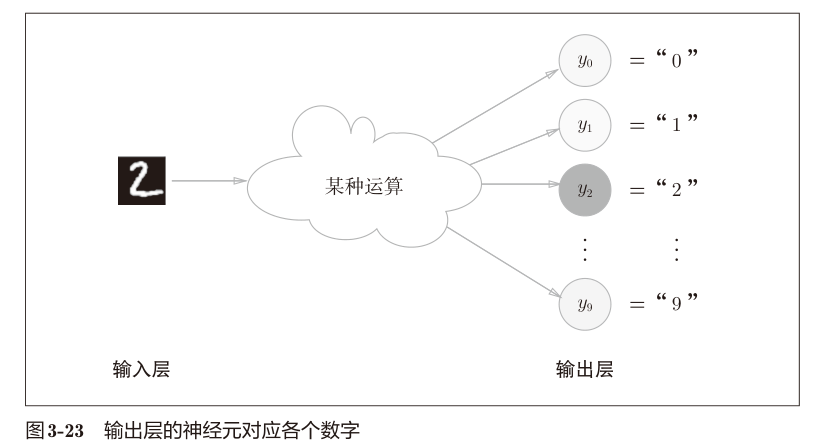

这个经典的例子就是了，识别手写数字，看看那个值最大。

# 手写数字识别

这么快就开始实战了嘛，那不是得用numpy手搓了嘛。

## MNIST数据集

这个数据集很经典很有名，0-9的数字手写，6万张训练图像，测试1万。

图像是28×28像素的灰度图像，像素在0-255之间，并且带有对应的标签。

但是好像还得获取这些数据呢。我们去github上面看看有没有附带的代码来下载这些数据。但是似乎好像报错啊。诶确实诶，我发现进去之后确实是已经没有任何数据了。使用一下AI给我的网址。

```python
// ... existing code ...
url_base = 'https://storage.googleapis.com/cvdf-datasets/mnist/'
// ... existing code ...
```

你看这样就成功了。

只要路径调整对了，就还是可以运行的。哈哈。别忘了调整到自己的文件夹啊。

```python
from MNIST.mnist import load_mnist
import sys
import os
sys.path.append(os.pardir)  # 为了导入父目录的文件而进行的设定

(x_train, y_train), (x_test, y_test) = load_mnist(flatten=True, normalize=False)

print(x_train.shape)  # (60000, 784)
print(y_train.shape)  # (60000,)
print(x_test.shape)  # (10000, 784)
print(y_test.shape)  # (10000,)
```

这个load_mnist函数flatten=True就保留了摊平的一维数组，False则是1×28×28的三维数组。normalize的作用是将原本0到255转换为0到1。其实还有一个one_hot_label的参数，是将标签存储为独热编码，这里我就不多介绍了。

```python
from MNIST.mnist import load_mnist
import sys
import os
import numpy as np
from PIL import Image
sys.path.append(os.pardir)


def img_show(img):
    pil_img = Image.fromarray(np.uint8(img))
    pil_img.show()


(x_train, t_train), (x_test, t_test) = load_mnist(flatten=True, normalize=False)
img = x_train[0]
label = t_train[0]
print(label)

print(img.shape)
img = img.reshape(28, 28)
print(img.shape)

img_show(img)
```

这里用PIL，似乎会调用我们电脑的图片查看器，反正长这样小小一个。

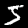

## 神经网络的推理处理

怎么设计神经网路呢？

输入是28×28=784个神经元，输出是0-9有10个神经元。

然后给两个隐藏层，（1）有50个，（2）有100个【我也不知道为啥】

没想到权重已经写好放在了一个pickle数据集里面了。

因为路径的问题，所以我有些不能运行成功，而且不知道为什么，调整了格式之后，就一定要先运行import之后才能修改路径，这个就比较麻烦了。怎么才能先运行修改路径然后再加入模块呢？似乎没有办法。这个等下回来再问AI吧。

OK了，解决了，只要增加关闭调整代码的上下两个注释就完事了。

```python
# fmt: off
os.chdir("D:\\Data\\知识库\\深度学习\\深度学习入门_鱼书\\代码\\03_神经网络")
from MNIST.mnist import load_mnist
# fmt: on 
```

类似这种。最后代码写成这样。可能和原文有些差距。

```python
import pickle
from PIL import Image
import numpy as np
import sys
import os
# fmt: off
os.chdir("D:\\Data\\知识库\\深度学习\\深度学习入门_鱼书\\代码\\03_神经网络")
from MNIST.mnist import load_mnist
# fmt: on  


def sigmoid(x):
    return 1/(1+np.exp(-x))


def softmax(a):
    c = np.max(a)
    exp_a = np.exp(a-c)
    sum_exp_a = np.sum(exp_a)
    y = exp_a / sum_exp_a
    return y


def get_data():
    (x_train, t_train), (x_test, t_test) = load_mnist(
        normalize=True, flatten=True, one_hot_label=False)
    return x_test, t_test


def init_network():
    with open("./MNIST/sample_weight.pkl", "rb") as f:
        network = pickle.load(f)

    return network


def predict(network, x):
    W1, W2, W3 = network['W1'], network['W2'], network['W3']
    b1, b2, b3 = network['b1'], network['b2'], network['b3']

    a1 = np.dot(x, W1)+b1
    z1 = sigmoid(a1)
    a2 = np.dot(z1, W2)+b2
    z2 = sigmoid(a2)
    a3 = np.dot(z2, W3)+b3
    y = softmax(a3)

    return y


x, t = get_data()
net_work = init_network()

accuracy_cnt = 0
for i in range(len(x)):
    y = predict(net_work, x[i])
    p = np.argmax(y) #最大值元素的索引
    if p == t[i]:
        accuracy_cnt += 1

print("Accuracy:" + str(float(accuracy_cnt) / len(x)))
# Accuracy:0.9352
```

首先获得MNIST数据集，生成网络，然后用for逐个对x进行预测，然后和t进行比对，对了就加正确率。

这里还涉及一个概念，就是把原本0 ~ 255转换为了0 ~ 1，这与normalize参数有关，这个过程称之为**正规化**，是一种**预处理**。

然后再来看看内部的一些细节。

```python
network = init_network()
W1, W2, W3 = network['W1'], network['W2'], network['W3']
x.shape
#(10000, 784)
x[0].shape
#(784,)
W1.shape
#(784, 50)
W2.shape
#(50, 100)
W3.shape
#(100, 10)
```

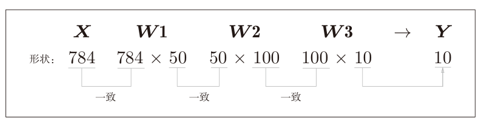

这是一个例子，一个一维数组经历的事情。

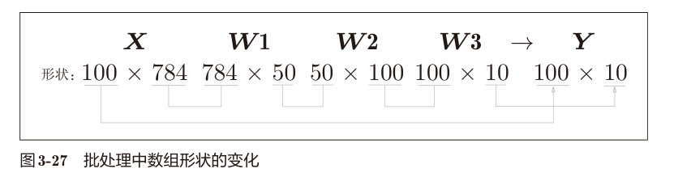

这是100个图形都进行运算。这种打包式的输入数据称为**批**（batch）。

> 批处理一次性计算大型数组要比分开逐步计算各个小型数组速度更快。

那基于批处理的代码要怎么写呢？

```python
# 批处理
batch_size = 100
for i in range(0, len(x), batch_size):
    x_batch = x[i:i+batch_size]
    y_batch = predict(net_work, x_batch)
    p_batch = np.argmax(y_batch, axis=1)
    accuracy_cnt += np.sum(p_batch == t[i:i+batch_size])

print("Accuracy:" + str(float(accuracy_cnt) / len(x)))
```

基本上是差不多的，就是输入变成了切片。然后取最大值索引的时候加上了axis=1的参数（有点R的apply的感觉了）

> 到这里就手搓了一个固定的神经网络了。（看来这个就是权重的公开啊）
