# 前言

**“学习”**是指从训练数据中自动获取最优权重参数的过程。学习的目的就是以该损失函数为基准，找出能使它的值达到最小的权重参数。

> 1. **线性可分问题的可学习性**
>    对于线性可分的数据（即能找到一条直线 / 超平面将不同类别完全分开），第 2 章介绍的感知机模型可以通过数据自动学习。其原理是感知机通过不断调整权重和偏置，逐步逼近能正确分类的超平面。
> 2. **感知机收敛定理的作用**
>    该定理从理论上保证了：对于线性可分问题，感知机的学习过程一定会在**有限步骤内结束**，最终找到一个能正确分类所有样本的超平面，即问题 “可解”。
> 3. **非线性可分问题的局限性**
>    当数据非线性可分时（找不到这样的直线 / 超平面），感知机的学习过程会陷入无限循环，无法收敛到一个稳定的解，因此**无法通过自动学习解决**。这体现了感知机模型的固有局限，也为后续更复杂模型（如神经网络）的出现提供了动机。

数据驱动：机器学习的方法则极力避免人为介入，尝试从收集到的数据中发现答案（模式）。神经网络或深度学习则比以往的机器学习方法更能避免人为介入。

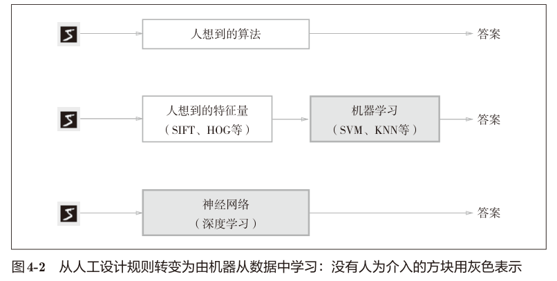

传统机器学习提取特征量，再用机器学习技术学习这些特征量的模式。

神经网络直接学习图像本身。

> 深 度 学 习 有 时 也 称 为 端 到 端 机 器 学 习（end-to-end machine learning）。

训练数据：使用训练数据进行学习，寻找最优的参数

测试数据：评价训练得到的模型的实际能力

泛化能力：处理未被观察过的数据（不包含在训练数据中的数据）的能力。是机器学习的最终目标。

过拟合：只对某个数据集过度拟合的状态称为过拟合（over fitting）。

# 损失函数

## 基础损失函数

损失函数：神经网络以损失函数为线索寻找最优权重参数。一般用均方误差和交叉熵误差等。表示神经网络性能的“恶劣程度”的指标，即当前的神经网络对监督数据在多大程度上不拟合，在多大程度上不一致。“使性能的恶劣程度达到最小”是目的。“使性能的优良程度达到最大”是等价的。

**均方误差**（mean squared error）
$$
E=\frac{1}{2}\displaystyle\sum_k(y_k-t_k)^2
$$
$y_k$是表示神经网络的输出，$t_k$表示监督数据，$k$表示数据的维数。

> 按理说是没有这个1/2才对的。

```python
import numpy as np


def mean_squared_error(y, t):
    return 0.5 * np.sum((y - t) ** 2)


y = [0.1, 0.05, 0.6, 0.0, 0.05, 0.1, 0.0, 0.1, 0.0, 0.0]
t = [0, 0, 1, 0, 0, 0, 0, 0, 0, 0]

mse = mean_squared_error(np.array(y), np.array(t))
print(mse)
# 0.09750000000000003
```

这里举了一个之前手写数字softmax输出的结果，可以看出这个测试的t是用独热编码写的，也就是one-hot

**交叉熵误差** （cross entropy error）
$$
E=-\displaystyle\sum_kt_k\log{y_k}
$$
因为$t_k$只有一个是1，所以实际上只计算了正解对应输出的log值，那么此时交叉熵误差就是正解对应的输出结果决定的。

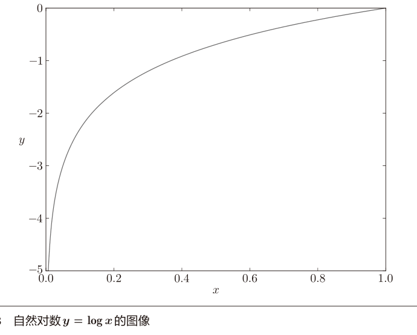

对数函数就不多讲了。但是这里，输出越大，交叉熵误差约接近0，输出为1，误差就是0。输出越小，损失函数就越大。

```python
def cross_entropy(y, t):
    delta = 1e-7  # 防止log(0)情况
    return -np.sum(t * np.log(y + delta))
    
ce = cross_entropy(np.array(y), np.array(t))
print(ce)
#0.510825457099338
```

为了防止出现`log(0)=-Inf`的情况导致无法运算，所以加了一个微小值。

## mini-batch的损失函数

前面都是单个数据的损失函数，计算损失函数的时候应该吧所有的训练数据作为对象。交叉熵误差的总和
$$
E=-\frac{1}{N}\displaystyle{\sum_n\sum_kt_{nk}\log{y_{nk}}}
$$
其实好像就是所有数据损失函数的算术平均数吧，也就是所有单个数据的“平均损失函数”

**mini-batch学习**：数据量很大的时候，计算所有的损失函数很漫长。选择一小批训练数据就是mini-batch（小批量），然后对每个mini-batch进行学习的过程，就是mini-batch学习。

```python
import sys
import os
import numpy as np
# fmt: off
sys.path.append(r"D:\Data\知识库\深度学习\深度学习入门_鱼书\代码\03_神经网络\MNIST")
from mnist import load_mnist
# fmt: on

(x_train, t_train), (x_test, t_test) = load_mnist(
    normalize=True, one_hot_label=True)

print(x_train.shape)# (60000, 784)
print(t_train.shape)# (60000, 10)
```

然后随机抽取10条数据

```python
train_size = x_train.shape[0]
batch_size = 10
batch_mask = np.random.choice(train_size, batch_size)
x_batch = x_train[batch_mask]
t_batch = t_train[batch_mask]
```

`np.random.choice(60000, 10)`可以在0-59999中随机抽取10个数据。相当于我们抽取的是索引。然后根据索引找到对应的训练数据和结果。

> 小批量学习，有点类似于抽样调查的感觉。

那mini-batch版的交叉熵误差用python写一下。这里的t是一个逻辑向量。

```python
def cross_entropy_error(y,t):
    if y.ndim == 1:
        y = y.reshape(1, y.size)
        t = t.reshape(1, t.size)
    
    batch_size = y.shape[0]
    return -np.sum(t * np.log(y + 1e-7)) / batch_size
```

当不是独热编码的时候，这里的t就是一个0-9的数字，当做索引来用。

```python
def cross_entropy_error(y, t):
	if y.ndim == 1:
		t = t.reshape(1, t.size)
		y = y.reshape(1, y.size)
	
	batch_size = y.shape[0]
	return -np.sum(np.log(y[np.arange(batch_size), t] + 1e-7)) / batch_size
```

这个我还是看得懂的，因为y的结果还是softmax的结果，因此我们只要取得第t个数字对应的结果就行了，而且乘1本身就被省略掉了。其余的就也是乘0的，忽略掉就完事了。

> t中标签是以 [2, 7, 0, 9, 4]的形式存储的。np.arange(batch_size)会生成一个 NumPy 数组 [0, 1, 2, 3, 4]。y[np.arange(batch_size), t] 会 生 成 NumPy 数 组 [y[0,2], y[1,7], y[2,0],y[3,9], y[4,4]]）。

## 损失函数的意义

寻找最优参数（权重和偏置）时，要寻找使损失函数的值尽可能小的参数。为了找到使损失函数的值尽可能小的地方，需要计算参数的导数（确切地讲是梯度），然后以这个导数为指引，逐步更新参数的值。

“如果稍微改变这个权重参数的值，损失函数的值会如何变化”。如果导数的值为负，通过使该权重参数向正方向改变，可以减小损失函数的值；反过来，如果导数的值为正，则通过使该权重参数向负方向改变，可以减小损失函数的值。不过，当导数
的值为0时，无论权重参数向哪个方向变化，损失函数的值都不会改变，此时该权重参数的更新会停在此处。

识别精度，也就是正确率。绝大多数地方的导数都会变为0，导致参数无法更新。为啥嘞，从某种意义上，和权重相比，正确率其实不是连续的。正确率就像投篮一样，100个投中32个，稍微调整了投篮角度和力度，可能还是32个，正确率不会变。但是实际和篮筐中心也有一定的偏差，这种小小的变化是无法识别的。

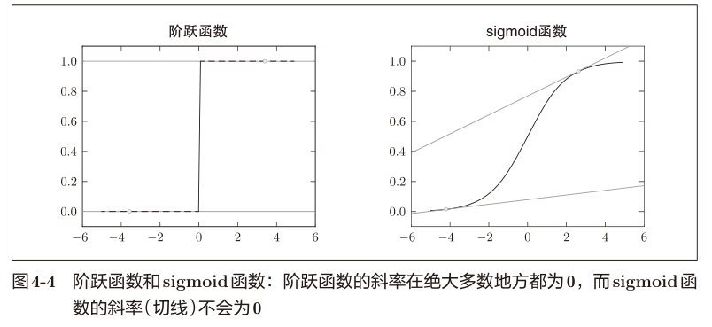

同样的道理用到激活函数上面，如果使用了阶跃函数，那参数的微小变化也会被抹除。还是sigmoid函数比较好，在各处的导数均不为0 。

# 数值微分

## 导数

糟了，到了学习数学的时候了。这本书果然是作为零基础入门的书籍啊。当做我们没有学习过数学。不过我确实算是基本没有学过。在学习梯度法之前，还是要学习一下导数的。但是你说一点基础没有，那也不至于哈哈。

这里举了一个例子，就是跑马拉松，平均速度的时间范围不短缩小，直到某个瞬间，变成了瞬时速度，导数就这么来了。导数表示某个瞬间的变化量。
$$
\frac{\mathrm{d}f(x)}{\mathrm{d}x}=\lim_{h\rightarrow0}\frac{f(x+h)-f(x)}{h}
$$
用python表示一下

```python
# 不好的示例
def numerical_diff(f, x):
    h = 10e-50
    return (f(x + h) - f(x)) / h
```

数值微分的英文 numerical differentiation

> 数值微分就是用数值方法近似求解函数导数。

这里h取太小了，在计算机中会产生**舍入误差**（rounding error）

```python
np.float32(1e-50)
# 0.0
```

32位浮点数不能表示这么小的数字，直接当做是0。然后这里的代码计算的只是(x + h)和x之间的斜率，不是真正的斜率，这是因为这么写，h不可能无限接近0。差别如图所示

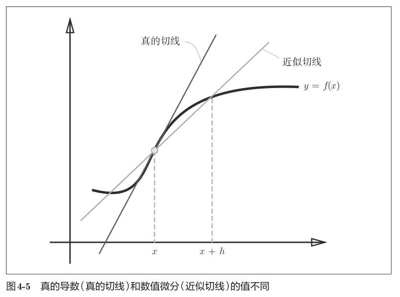

用**中心差分**的方法可以一定程度上减小误差。也就是计算函数f在(x + h)和(x − h)之间的差分。（(x + h)和x之间的差分也叫**前向差分**）

```python
# 中心差分
def numerical_diff(f, x):
    h = 1e-4  # 0.0001
    return (f(x + h) - f(x - h)) / (2 * h)
```

> 数值微分：微小的差分求导数的过程
>
> 解析求导：基于数学式的推导求导数的过程。比如$y=x^2$的导数，$\frac{\mathrm{d}y}{\mathrm{d}x}=2x$。这样计算得到的导数是不含误差的真的导数。

来看看实例
$$
y=0.01x^2+0.1x
$$

```python
import numpy as np
import matplotlib.pyplot as plt


def function_1(x):
    return 0.01*x**2 + 0.1*x


x = np.arange(0.0, 20.0, 0.1)
y = function_1(x)
plt.xlabel("x")
plt.ylabel("f(x)")
plt.plot(x, y)
plt.show()
```

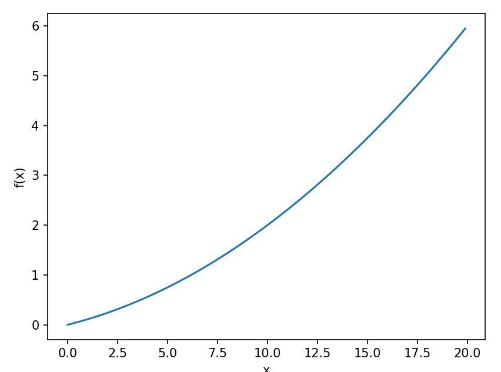

计算一下这个函数在x = 5和x = 10处的导数。

```python
numerical_diff(function_1, 5)
#0.1999999999990898
numerical_diff(function_1, 10)
#0.2999999999986347
```

事实上根据我们高中学过的知识，这个$f(x)=0.01x^2+0.1x$的解析解是$\frac{\mathrm{d}y}{\mathrm{d}x}=0.02x+0.1$，在$x=5$和$x=10$处的导数是0.2和0.3。误差也不大。

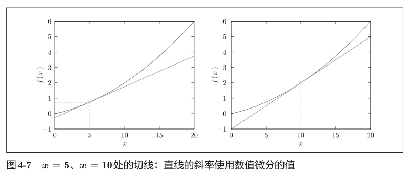

## 偏导数

这里开始好像就是没有学过的知识了。这里有一个双变量的函数。
$$
f(x)=x_0^2+x_1^2
$$

```python
def function_2(x):
    return x[0]**2 + x[1]**2
```

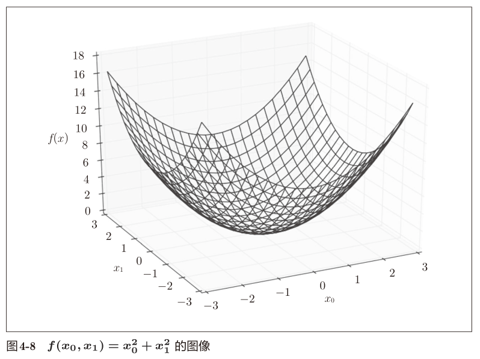

多个变量的导数就是**偏导数**，分别针对两个变量，可以写成$\frac{\partial f}{\partial x_0}$、$\frac{\partial f}{\partial x_1}$

> 我先来靠AI速成一下偏导数的知识。
>
> 偏导数是多元函数微分学的核心概念，本质是 “固定其他变量，对单个变量求导”。
>
> 多元函数：有两个及以上自变量
>
> 定义：对二元函数 $z = f(x,y)$：
>
> - **对 x 的偏导数**：固定 y 为常数，只把 x 当自变量，求导结果记为 $f_x'(x,y)$ 或 $\frac{\partial z}{\partial x}$。 数学定义（极限形式）：$\frac{\partial z}{\partial x} = \lim_{\Delta x \to 0} \frac{f(x+\Delta x, y) - f(x,y)}{\Delta x}$
> - **对 y 的偏导数**：固定 x 为常数，只把 y 当自变量，求导结果记为 $f_y'(x,y)$ 或 $\frac{\partial z}{\partial y}$。 极限形式类似，只需把 $\Delta x$ 换成 $\Delta y$，固定 x 即可。
>
> 几何：二元函数 $z = f(x,y)$ 的图像是三维空间中的曲面。
>
> - $\frac{\partial z}{\partial x}$：曲面在点 $(x_0,y_0,z_0)$ 处，**沿 x 轴方向的切线斜率**（此时用平面 $y = y_0$ 截曲面，得到一条曲线，斜率即偏导数）。
> - $\frac{\partial z}{\partial y}$：同理，是沿 y 轴方向的切线斜率。
>
> 偏导数的计算：**核心原则**：把其他变量看作常数，用一元函数求导公式计算。
>
> - 求 $z = x^2 + 3xy + y^3$ 的偏导数。
>   - 对 x 求偏导（固定 y 为常数）：$\frac{\partial z}{\partial x} = 2x + 3y$（注：3xy 中 y 是常数，导数为 3y；$y^3$ 是常数，导数为 0）。
>   - 对 y 求偏导（固定 x 为常数）：$\frac{\partial z}{\partial y} = 3x + 3y^2$（注：$x^2$ 是常数，导数为 0；3xy 中 x 是常数，导数为 3x）。
> - 求 $z = e^{xy} \cdot \sin(x + y)$ 的偏导数（含乘积和复合函数）。
>   - 对 x 求偏导（用乘积法则：$(uv)' = u'v + uv'$）： 令 $u = e^{xy}$，$v = \sin(x + y)$。u 对 x 求导：$\frac{\partial u}{\partial x} = e^{xy} \cdot y$（复合函数求导，内层 xy 对 x 导数为 y）。v 对 x 求导：$\frac{\partial v}{\partial x} = \cos(x + y) \cdot 1$（内层 $x + y$ 对 x 导数为 1）。 因此：$\frac{\partial z}{\partial x} = y e^{xy} \sin(x + y) + e^{xy} \cos(x + y)$。
>   - 对 y 求偏导（同理，固定 x）：$\frac{\partial u}{\partial y} = e^{xy} \cdot x$，$\frac{\partial v}{\partial y} = \cos(x + y) \cdot 1$。 因此：$\frac{\partial z}{\partial y} = x e^{xy} \sin(x + y) + e^{xy} \cos(x + y)$。

OK，稍微懂了一点，不过后面还有一些进阶内容就先不学了。再来看看这个平方和的偏导数，其实固定一个，另一个就是$2x$不过这个是解析解。

再回到这里，就需要具体的数值，相当于求两个二次函数的数值微分了。

求x0 = 3, x1 = 4时，两个偏导数

```python
def function_2(x):
    return x[0]**2 + x[1]**2


def function_tmp1(x0):
    return x0*x0 + 4.0**2.0


def function_tmp2(x1):
    return 3.0**2.0 + x1*x1


numerical_diff(function_tmp1, 3.0) #6.00000000000378
numerical_diff(function_tmp2, 4.0) #7.999999999999119
```

那要我算解析解，第一个是6，第二个是8。没毛病了。而且这里也不涉及特别复杂的东西，计算机要求的数值微分更加具体一点。

# 梯度

如果要同时确定$x0 = 3, x1 = 4$时$(x0, x1)$的偏导数向量$(\frac{\partial f}{\partial x_0}，\frac{\partial f}{\partial x_1})$？这种由全部变量的偏导数汇总而成的向量就是**梯度**（gradient）

```python
import numpy as np

def numerical_gradient(f, x):
    h = 1e-4
    grad = np.zeros_like(x) #生成一个形状和 x相同、所有元素都为0的数组。

    for idx in range(x.size):
        tmp_val = x[idx]
        x[idx] = tmp_val + h
        fxh1 = f(x)  # f(x+h)
        x[idx] = tmp_val - h
        fxh2 = f(x)  # f(x-h)
        grad[idx] = (fxh1 - fxh2) / (2 * h)
        x[idx] = tmp_val

    return grad
```

我还以为啥呢，原来其实就是写了一个循环遍历了一遍，分别求解每个元素的偏导数嘛。

```python
numerical_gradient(function_2, np.array([3.0, 4.0]))
#array([6., 8.])
numerical_gradient(function_2, np.array([0.0, 0.2]))
#array([0. , 0.4])
numerical_gradient(function_2, np.array([3.0, 0.0]))
#array([0. , 0.4])
```

> 实际上，虽然求到的值是 [6.0000000000037801, 7.9999999999991189]，但实际输出的是 [6., 8.]。这是因为在输出NumPy数组时，数值会被改成“易读”的形式。

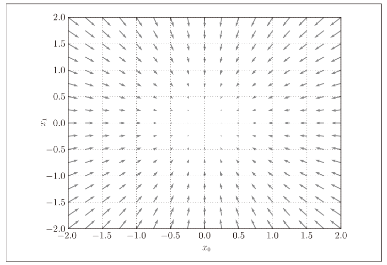

作者画出了负梯度的向量方向（切线有两个方向，可以理解）。这个曲面比较简单，梯度指向了最低处。梯度会指向各点处的函数值降低的方向。==梯度指示的方向是各点处的函数值减小最多的方向==。

> 可以在空间上想象，所有下降方向中，梯度方向下降最多。
>
> 方向导数= cos(θ) × 梯度（θ是方向导数的方向与梯度方向的夹角）。

## 梯度法

损失函数很复杂，参数空间很庞大，无法想象形态，不知道哪里是最小值，所以需要利用梯度寻找最小值（或尽可能小的值），这就是梯度法。

因为之前的例子简单，梯度的方向就是最小值的方向。但是复杂函数中，梯度只是的方向基本上都不是最小值的方向。只能说是各个点处函数值减小最多的方向。

> 极小值：局部最小值。梯度法有时找到梯度为0的地方，可能是鞍点（包含极小值和最小值）。
>
> 扁平状的复杂函数，学习也会进入一个无法前进的停滞期。

从当前位置沿着梯度方向前进，然后在新的地方求梯度，逐渐减小函数值，这就是梯度法的原理。

> 严格来讲，这里其实是梯度下降法。不过上升和下降本身就是符号的差别，神经网络中一般都是指梯度下降法。

$$
x_0=x_0-\eta\frac{\partial f}{\partial x_0}\\
x_1=x_1-\eta\frac{\partial f}{\partial x_1}
$$

$\eta$（eta）表示更新量，神经网络称之为**学习率**（learning rate），感觉有点像之前的h。决定了一次学习，多大程度地改变了参数。

```python
def gradient_descent(f,init_x,lr=0.01,step_num=100):
    x = init_x

    for i in range(step_num):
        grad = numerical_gradient(f,x)
        x -= lr*grad

    return x

init_x = np.array([-3.0,4.0])
print(gradient_descent(function_2,init_x,lr=0.1,step_num=100))
# [-6.11110793e-10  8.14814391e-10]
```

用python求$f(x_0+x_1)=x_0^2+x_1^2$的最小值，最后的结果非常贴近（0,0）

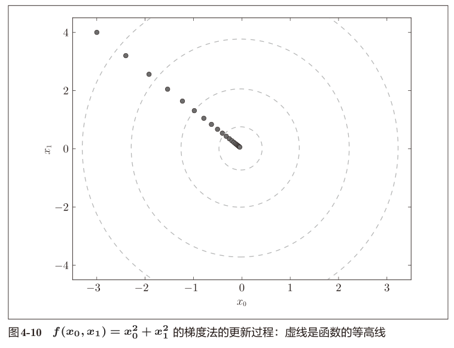

学习率太大或太小都不好。（学习次数一样的时候）

```python
init_x = np.array([-3.0, 4.0])
print(gradient_descent(function_2, init_x, lr=10.0, step_num=100))
# [-2.58983747e+13 -1.29524862e+12]
init_x = np.array([-3.0, 4.0])
print(gradient_descent(function_2, init_x, lr=1e-10, step_num=100))
# [-2.99999994  3.99999992]
```

学习率太大会发散乘一个很大的值，太小很快就结束了。

> 一开始我有点想不清楚为什么学习率太大会发散而不是收敛，但是看了AI提供的例子就明白了。
>
> 损失 $L(w) = \frac{1}{2}w^2$（无输入 x，最小值在 \(w=0\)
>
> 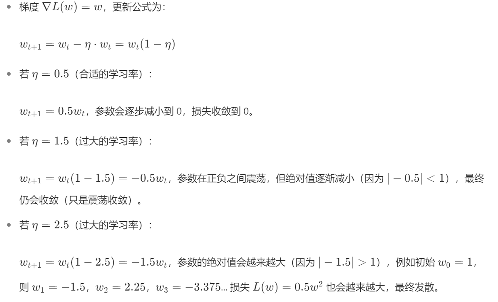

学习率这样参数称为**超参数**。神经网络的参数是权重和偏置，可以通过训练和学习获得。但是学习率只能是人工设定。一般超参数需要尝试多个值，以便找到一个好的设置。

## 神经网络的梯度

把梯度法迁移到神经网络，其实是指损失函数关于权重参数的梯度。
$$
W=
\left(
\begin{array}{l}
w_{11} & w_{12} & w_{13}\\
w_{21} & w_{22} & w_{23}
\end{array}
\right)\\
\frac{\partial L}{\partial W}=
\left(
\begin{array}{l}
\frac{\partial L}{\partial w_{11}} & \frac{\partial L}{\partial w_{12}} & \frac{\partial L}{\partial w_{13}}\\
\frac{\partial L}{\partial w_{21}} & \frac{\partial L}{\partial w_{22}} & \frac{\partial L}{\partial w_{23}}
\end{array}
\right)
$$
一个2×3的权重神经网络$W$，然后得到偏导数。

```python
import numpy as np
import os
import sys
# fmt: off
sys.path.append(os.pardir)
from common.functions import softmax, cross_entropy_error
from common.gradient import numerical_gradient
# fmt: on

class simpleNet:
    def __init__(self):
        self.W = np.random.randn(2, 3) #用高斯分布进行初始化
    
    def predict(self, x):
        return np.dot(x, self.W)
    
    def loss(self, x, t):
        z = self.predict(x)
        y = softmax(z)
        loss = cross_entropy_error(y, t)
        return loss
```

这里作者写了一个简易的类。包含一个随机生成的权重，一个计算输出的predict函数，一个计算损失函数的函数。这里需要使用作者提供的代码，免得重新写这些基础的代码。（如果忘了还得复习一下前面的知识）

然后测试一下。（因为随机种子不一样，肯定不能一模一样复现人家的结果）

```python
net = simpleNet()
print(net.W)

x = np.array([[0.6, 0.9]])
p = net.predict(x)
print(p)
np.argmax(p)

t = np.array([[1, 0, 0]])
net.loss(x, t)
```

然后计算梯度

```python
def f(W):
    return net.loss(x, t)

dW = numerical_gradient(f, net.W)
print(dW)
```

不过我不理解，这个f(W)难道不会报错吗。虽然看上去是个伪参数。不过好像在内部也会执行f(x)。比较高深了。

> ```python
> f = lambda w: net.loss(x, t)
> # 一行的简单函数可以用lambda
> ```

作者得到的梯度（向量）是

```python
[[ 0.21924763 0.14356247 -0.36281009]
[ 0.32887144 0.2153437 -0.54421514]]
```

告诉我们，第一个$w_{11}$，如果加个h，那么损失函数就会加个0.2h。同理$w_{23}$是的损失函数减少0.5h。为了使得损失函数降低，应该正向更新$w_{23}$，负向更新$w_{11}$。并且要更大程度地更新$w_{23}$才是好事。

求出了此时的梯度后，只需要根据梯度法，调整（更新）参数就好了。

# 实现学习算法

在这里总结一下神经网络的学习步骤，以及前面学习过的基础知识。原文已经很简洁了。直接复制了。

> **前提**
> 神经网络存在合适的权重和偏置，调整权重和偏置以便拟合训练数据的
> 过程称为“学习”。神经网络的学习分成下面4个步骤。
>
> **步骤1（mini-batch）**
> 从训练数据中随机选出一部分数据，这部分数据称为mini-batch。我们
> 的目标是减小mini-batch的损失函数的值。
>
> **步骤2（计算梯度）**
> 为了减小mini-batch的损失函数的值，需要求出各个权重参数的梯度。
> 梯度表示损失函数的值减小最多的方向。
>
> **步骤3（更新参数）**
> 将权重参数沿梯度方向进行微小更新。
>
> **步骤4（重复）**
> 重复步骤1、步骤2、步骤3。

随机选择mini-batch数据，所以又称为**随机梯度下降法**（stochastic gradient descent，SGD）

## 2层神经网络的类

这里作者写了一个很长的类。

```python
import sys
import os
import numpy as np
# fmt:off
sys.path.append(os.pardir)
from common.functions import *
from common.gradient import numerical_gradient
# fmt:on


class TwoLayerNet:
    # 初始化权重
    def __init__(self, input_size, hidden_size, output_size, weight_init_std=0.01):
        self.params = {}
        self.params['W1'] = weight_init_std * \
            np.random.randn(input_size, hidden_size)
        self.params['b1'] = np.zeros(hidden_size)
        self.params['W2'] = weight_init_std * \
            np.random.randn(hidden_size, output_size)
        self.params['b2'] = np.zeros(output_size)

    def predict(self, x):
        W1, W2 = self.params['W1'], self.params['W2']
        b1, b2 = self.params['b1'], self.params['b2']

        a1 = np.dot(x, W1) + b1
        z1 = sigmoid(a1)
        a2 = np.dot(z1, W2) + b2
        y = softmax(a2)
        return y

    def loss(self, x, t):
        y = self.predict(x)
        return cross_entropy_error(y, t)

    def accuracy(self, x, t):
        y = self.predict(x)
        y = np.argmax(y, axis=1)
        t = np.argmax(t, axis=1)

        accuracy = np.sum(y == t) / float(x.shape[0])
        return accuracy

    def numerical_gradient(self, x, t):
        def loss_W(W): return self.loss(x, t)

        grads = {}
        grads['W1'] = numerical_gradient(loss_W, self.params['W1'])
        grads['b1'] = numerical_gradient(loss_W, self.params['b1'])
        grads['W2'] = numerical_gradient(loss_W, self.params['W2'])
        grads['b2'] = numerical_gradient(loss_W, self.params['b2'])

        return grads

```

一行行看下来倒是勉强可以看懂，但是让我直接手搓，我肯定是想不出来的。

```python
# -------
net = TwoLayerNet(input_size=784, hidden_size=100, output_size=10)
print(net.params['W1'].shape)  # (784, 100)
print(net.params['b1'].shape)  # (100,)
print(net.params['W2'].shape)  # (100, 10)
print(net.params['b2'].shape)  # (10,)

x = np.random.rand(100, 784)  # 伪输入100个
t = np.random.rand(100, 10)  # 伪正解100个

grads = net.numerical_gradient(x, t)  # 计算梯度，有点慢这里
print(grads['W1'].shape)  # (784, 100)
print(grads['b1'].shape)  # (100,)
print(grads['W2'].shape)  # (100, 10)
print(grads['b2'].shape)  # (10,)
```

看看这里的实例。

输入784个神经元，隐藏100个神经元，输出层10个神经元。这是因为手写数字的MNIST符合这个数量。

这里先用高斯分布初始化权重，偏置都设置为0了。predict计算到隐藏层的结果。loss计算输出和结果的交叉熵误差，accuracy则计算准确度。numerical_gradient计算参数的梯度。然后权重和梯度都各自保存在一个字典当中。

> 这里numerical_gradient速度有点慢，之后会用误差反向传播法计算梯度。

## mini-batch的实现

```python
import numpy as np
import os
import sys
# fmt:off
sys.path.append(os.pardir)
from dataset.mnist import load_mnist
from two_layer_net import TwoLayerNet
# fmt:on

# 读入数据
(x_train, t_train), (x_test, t_test) = load_mnist(
    normalize=True, one_hot_label=True)

train_loss_list = []

# 超参数
iters_num = 10000  # 迭代次数
train_size = x_train.shape[0]  # 训练数据的大小
batch_size = 100  # 批处理大小
learning_rate = 0.1  # 学习率

network = TwoLayerNet(input_size=784, hidden_size=50, output_size=10)

for i in range(iters_num):
    # 获取mini-batch
    batch_mask = np.random.choice(train_size, batch_size)  # 随机选择100个样本
    x_batch = x_train[batch_mask]
    t_batch = t_train[batch_mask]

    # 计算梯度
    grads = network.numerical_gradient(x_batch, t_batch)
    # grads = network.gradient(x_batch, t_batch) #我暂时还没有

    # 更新参数
    for key in ('W1', 'b1', 'W2', 'b2'):
        network.params[key] -= learning_rate * grads[key]

    # 记录学习过程
    loss = network.loss(x_batch, t_batch)
    train_loss_list.append(loss)

```

每次从60000个数据抽取100个mini-batch，然后求梯度，使用随机下降法更新参数，更新10000次。我感觉会很花费时间。我这里暂时就不运行了吧。应该是可以运行成功的。虽然是我抄的代码。

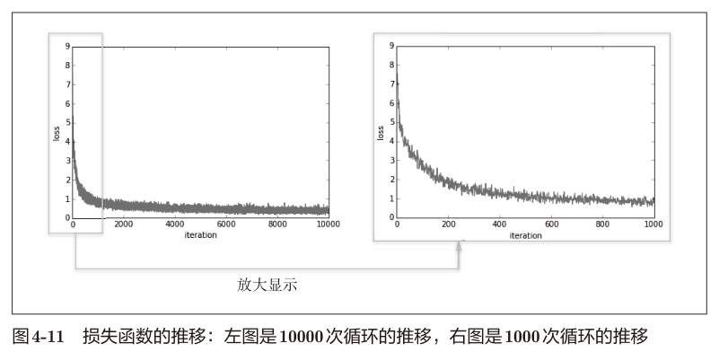

作者记录的损失函数是不断减小的。

## 基于测试数据的评价

那么隐藏的问题来了：会过拟合吗？

这里损失函数的值是“对训练函数某个mini-batch的损失函数“的值，不能表面在其他数据集也有一样的表现。

因此评价就不能使用训练数据中的样本。

在学习的过程中，需要定期对训练数据和测试数据记录识别精度。这里就涉及到了epoch这个单位。

一个epoch表示学习中所有训练数据均被使用过一次时的更新次数。

> 对于10000笔训练数据，用大小为100笔数据的mini-batch进行学习时，重复随机梯度下降法100次，所有的训练数据就都被“看过”了。此时，100次就是一个epoch。
>
> （这是比较理想了，但是因为我们这里mini-batch是随机选择的，因此一个epoch也不一定会看到全部10000个数据。

```python
import numpy as np
import os
import sys
# fmt:off
sys.path.append(os.pardir)
from dataset.mnist import load_mnist
from two_layer_net import TwoLayerNet
# fmt:on

# 读入数据
(x_train, t_train), (x_test, t_test) = load_mnist(
    normalize=True, one_hot_label=True)

train_loss_list = []
train_acc_list = []
test_acc_list = []

# 超参数
iters_num = 10000  # 迭代次数
train_size = x_train.shape[0]  # 训练数据的大小
batch_size = 100  # 批处理大小
learning_rate = 0.1  # 学习率

# 每个epoch的重复次数
iter_per_epoch = max(train_size / batch_size, 1)


network = TwoLayerNet(input_size=784, hidden_size=50, output_size=10)

for i in range(iters_num):
    # 获取mini-batch
    batch_mask = np.random.choice(train_size, batch_size)  # 随机选择100个样本
    x_batch = x_train[batch_mask]
    t_batch = t_train[batch_mask]

    # 计算梯度
    grads = network.numerical_gradient(x_batch, t_batch)
    # grads = network.gradient(x_batch, t_batch) #我暂时还没有

    # 更新参数
    for key in ('W1', 'b1', 'W2', 'b2'):
        network.params[key] -= learning_rate * grads[key]

    # 记录学习过程
    loss = network.loss(x_batch, t_batch)
    train_loss_list.append(loss)
    # 计算每个epoch的识别精度
    if i % iter_per_epoch == 0:
        train_acc = network.accuracy(x_train, t_train)
        test_acc = network.accuracy(x_test, t_test)
        train_acc_list.append(train_acc)
        test_acc_list.append(test_acc)
        print("train acc, test acc | " + str(train_acc) + ", " + str(test_acc))

```

实际上就是在循环过程中每隔一个epoch大小的迭代，就多记录一个精确度这个数据即可。妙啊。

试了一下，其实是可以运行的，就是比较慢而已。大概半分钟迭代一次。不过能运行就已经很不错了。

# 小结

下一章就开始学习误差反向传播法，估计是数值差分求这个梯度的速度还是太慢了，通过计算的方法改善总体的学习速度是很不错的方式。
