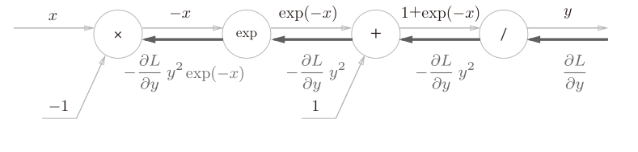

# 前言

数值微分：实现起来简单，但是计算上耗费时间。

误差反向传播法能更高效计算权重参数（在损失函数上）的梯度

这本书没有基于数学式，而是基于计算图（computational graph）理解误差反向传播法。

# 计算图

## 计算图求解

感觉有点涉及图论的思想了。用节点和边表示计算过程。

这边作者举了一个简单的例子

> 问题1： 太郎在超市买了2个100日元一个的苹果，消费税是10%，请计算支付金额。


也可以在圈内只放上乘号，系数放在外面


再来了一个复杂一点的例子

> 问题2： 太郎在超市买了2个苹果、3个橘子。其中，苹果每个100日元，橘子每个150日元。消费税是10%，请计算支付金额。


总结计算图解题的流程

1. 构建计算图
2. 在计算图上，从左向右进行计算

这样的正方向的传播，简称为**正向传播**（forward propagation）

那反向传播（backward propagation）是什么呢？

## 局部计算

计算图的特征是可以通过传递“局部计算”获得最终结果。无论全局发生了什么，都能只根据与自己相关的信息输出接下来的结果。


计算图可以集中精力在局部计算。作者类似流水线作业，组装汽车一样。

## 反向传递导数

但是作者说，更重要的原因是反向传播高效计算导数。

苹果价格上涨多少，支付金额增加多少？苹果价格$x$，支付金额$L$，求的就是$\frac{\partial L}{\partial x}$


从右向左传递导数的值（1 → 1.1 → 2.2）。

感觉稍微理解了一些，但是没有完全理解。

# 链式法则

传递这个局部导数的原理，是基于链式法则（chain rule）的。

## 反向传播


局部导数$\frac{\partial y}{\partial x}$乘以上游传来的值$E$，然后传递给前面的节点。这就是反向传播的计算顺序。实现的原理是链式法则

## 链式法则

这里利用了复合函数导数的性质。（感觉好像没学过了）

> 如果某个函数由复合函数表示，则该复合函数的导数可以用构成复合函数的各个函数的导数的乘积表示。

先写一个函数$z=(x+y)^2$，可以写成两个式子
$$
z=t^2\\
t=x+y
$$
那么z关于x的导数可以写成
$$
\frac{\partial z}{\partial x}=\frac{\partial z}{\partial t}\frac{\partial t}{\partial x}
$$
("好像"可以相互抵消，但是我们知道导数表示的并不是除法)

那这样我们就可以求出局部的导数
$$
\frac{\partial z}{\partial t}=2t\\
\frac{\partial t}{\partial x}=1
$$
所以可求得最终的导数
$$
\frac{\partial z}{\partial x}=\frac{\partial z}{\partial t}\frac{\partial t}{\partial x}=2t\cdot{}1=2(x+y)
$$
该说不说，好像不用这个方法，咱们根据高中知识也能得出差不多的结果。但是这个链式法则还是很重要的。

## 链式法则和计算图

把上面这个平方和画成计算图


这里最上游放上了$\frac{\partial z}{\partial z}$，相当于1，在之前的数学式被省略了。


# 反向传播

## 加法节点的反向传播

以$z=x+y$为例，分别可以求得$x$和$y$的导数其实都是1


也别管上游经历了什么运算，得到的$\frac{\partial L}{\partial z}$反向传播的时候原封不动游回了上面的节点。


放上具体的数字，那还是一样，加法的反向传播是不变的。

## 乘法的反向传播

以$z=xy$为例，那偏导数就不是1了
$$
\frac{\partial z}{\partial x}=y \\
\frac{\partial z}{\partial y}=x
$$
相当于互换了。将上游的值乘以搭档的输入信号。


## 苹果的例子

回到苹果的例子。苹果价格，个数，消费税是变量，都会影响最终的支付金额。


经过两次“翻转”的反向传播，可以知道

其他不变的情况下，消费税产生200倍的影响，价格2.2倍，个数110倍影响。（消费税的量纲不一样，1是100%，价格的1是1元）

顺便做了一下小练习，本质还是“翻转”或者“继承”


# 简单层的实现

这里要改名了，乘法节点成为“乘法层”（MulLayer），加法节点称为“加法层”（AddLayer）。

## 乘法层

```python
class MulLayer:
    def __init__(self):
        self.x = None
        self.y = None

    def forward(self, x, y):
        self.x = x
        self.y = y
        out = x * y
        return out

    def backward(self, dout):
        dx = dout * self.y  # 翻转x和y后乘上游来的导数
        dy = dout * self.x
        return dx, dy
```

这个层需要实现正向的乘法和反向的翻转相乘的两个功能。

然后用前面苹果的例子验证一下。


```python
# 买苹果
apple = 100
apple_num = 2
tax = 1.1
#layer
mul_apple_layer = MulLayer()
mul_tax_layer = MulLayer()
#forward
apple_price = mul_apple_layer.forward(apple,apple_num)
price = mul_tax_layer.forward(apple_price,tax)

print(price)# 220
```

其实就是封装了几个乘法

```python
dprice = 1
dapple_price, dtax = mul_tax_layer.backward(dprice)
dapple, dapple_num = mul_apple_layer.backward(dapple_price)

print(dapple, dapple_num, dtax)# 2.2 110 200
```

这个给一个上游，返回两个翻转的导数。

## 加法层

```python
class AddLayer:
    def __init__(self):
        pass

    def forward(self, x, y):
        out = x+y
        return out

    def backward(self, dout):
        dx = dout * 1
        dy = dout * 1
        return dx, dy
```

因为加法层其实不需要再前向的时候保存输入，所以初始化的时候直接pass就好了。前向相加后传递，反向直接原值分给上游传递。

然后咱们来买橘子和苹果


```python
# 实例
apple = 100
apple_num = 2
orange = 150
orange_num = 3
tax = 1.1

# layer
mul_apple_layer = MulLayer()
mul_orange_layer = MulLayer()
add_apple_orange_layer = AddLayer()
mul_tax_layer = MulLayer()

# forward
apple_price = mul_apple_layer.forward(apple, apple_num)  # 苹果的总价
orange_price = mul_orange_layer.forward(orange, orange_num)  # 橘子的总价
all_price = add_apple_orange_layer.forward(apple_price, orange_price)  # 总价
price = mul_tax_layer.forward(all_price, tax)  # 含税总价

# backward
dprice = 1
dall_price, dtax = mul_tax_layer.backward(dprice)  # 含税总价的梯度
dapple_price, dorange_price = add_apple_orange_layer.backward(
    dall_price)  # 总价的梯度
dapple, dapple_num = mul_apple_layer.backward(dapple_price)  # 苹果的梯度
dorange, dorange_num = mul_orange_layer.backward(dorange_price)  # 橘子的梯度

# 输出
print(price)
print(dapple_num, dapple, dorange_num, dorange, dtax)
```

虽然看着步骤有点多，但是其实每步都还是蛮好理解的。

先正向传播计算出含税总价，然后再反向传播求得每个参数对含税总价的梯度（也就是影响）

# 激活函数层的实现

看看激活函数ReLU和Sigmoid层是怎么实现的吧。

## ReLU层

复习一下激活函数ReLU（Rectified Linear Unit）
$$
y=
\begin{cases}
x&(x\gt0)\\
0&(x\leq0)
\end{cases}
$$
可求得导数
$$
\frac{\partial y}{\partial x}=
\begin{cases}
1&(x\gt0)\\
0&(x\leq0)
\end{cases}
$$
也就是说，如果正向传播输入x大于0，那么反向传播时原封不动传递给上游。如果x小于0，那反向传播到此为止。


用python写就是

```python
# ReLU层
class ReLu:
    def __init__(self):
        self.mask = None

    def forward(self, x):
        self.mask = (x <= 0)
        out = x.copy()
        out[self.mask] = 0
        return out

    def backward(self, dout):
        dout[self.mask] = 0
        dx = dout
        return dx
```

虽然作者没有写完整的例子验证，我写了一个不那么严谨的试试看

```python
# test----
x = np.array([[1.0, -0.5], [-2.0, 3.0]])
print(x)
mask = (x <= 0)
print(mask)
[[False  True]
 [ True False]]
a = ReLu()
dout = x**0 #一个2×2的都是1的方阵
b = a.forward(x)
print(b)
[[1. 0.]
 [0. 3.]]
c = a.backward(dout)
print(c)
[[1. 0.]
 [0. 1.]]
```

正向传播输入小于0，反向传播就是0。

mask这个变量记录了非零元素的位置，用来保留正向的值，也保留反向传播的值，其他的都是0。

> ReLU层的作用就像电路中的开关一样。正向传播时，有电流通过的话，就将开关设为ON；没有电流通过的话，就将开关设为OFF。反向传播时，开关为ON的话，电流会直接通过；开关为OFF的话，则不会有电流通过。

## Sigmoid层

复习一下sigmoid函数
$$
y=\frac{1}{1+\exp{(-x)}}
$$
可以用计算图这么表示正向传播x到y的过程


还多了一个exp和取倒数的运算。还好这些导数我们还留有一点印象。$y=\frac{1}{x}$的解析解是
$$
\frac{\partial y}{\partial x}=-\frac{1}{x^2}=-y^2
$$
这个也是蛮神奇的。如果是单纯的数学式，那多半是不能这么写的。但是实际y也是一个数值。所以直接把$-y^2$反向传播回去。


遇到了一个加法层，原封不动传回去


我们知道$y=e^x$的导数还是自己不变
$$
\frac{\partial y}{\partial x}=\exp{(x)}
$$
那在这里里面本身就有一个负号可别忘了。



遇到了一个乘法层，那就“翻转”后乘法回去，这里只要乘一个-1即可。


最终反向传播的输出是$\frac{\partial L}{\partial y}y^2\exp{(-x)}$，这个反向传播的值与正向传播的输入x和输出y相关。简化这个sigmoid层表示为


甚至还能进一步整理为
$$
\begin{aligned}
\frac{\partial L}{\partial y}y^2\exp{(-x)}
&=\frac{\partial L}{\partial y}\frac{1}{(1+\exp{(-x)})^2}\exp{(-x)}\\
&=\frac{\partial L}{\partial y}\frac{1}{1+\exp{(-x)}}\frac{\exp{(-x)}}{1+\exp{(-x)}}\\
&=\frac{\partial L}{\partial y}y(1-y)
\end{aligned}
$$
这样甚至只需要根据正向传播的输出就可以计算出来了。

用python写一下就是

```python
# Sigmod层
class Sigmoid:
    def __init__(self):
        self.out = None

    def forward(self, x):
        out = 1 / (1 + np.exp(-x))
        self.out = out
        return out

    def backward(self, dout):
        dx = dout * (1.0 - self.out) * self.out
        return dx
```

# Affine/Softmax层的实现

## Affine层

好像是一个新的概念。。。。

回顾一下神经网络的正向传播，是一个加权信号的总和，用到了矩阵的乘法

```python
X = np.random.rand(2) # 输入
W = np.random.rand(2,3) # 权重
B = np.random.rand(3) # 偏置

X.shape # (2,)
W.shape # (2, 3)
B.shape # (3,)

Y = np.dot(X, W) + B
```

> 事实上，这个(2,)是一个1×2的哦，但是(2,3)还是2×3的矩阵。我说怎么看起来这么违和呢。


> 神经网络的正向传播中进行的矩阵的乘积运算在几何学领域被称为“仿射变换”
> 因此，这里将进行仿射变换的处理实现为“Affine层”。
>
> 几何中，仿射变换包括一次线性变换和一次平移，分别对应神经网络的加权和运算与加偏置运算。


不过这里流动的已经不是标量了，而是矩阵。


然而前面也没告诉我们矩阵的点乘翻转的同时还要转置啊。不过根据乘法原则，不转置确实是乘不了的。不过如果是通过数学式，倒是勉强可以看出来是转置输入的。看来这里证明还得是通过数学式，虽然没有超纲，但是理解起来还是费力的。总之最终原本参数的偏导数是
$$
\frac{\partial L}{\partial X}=\frac{\partial L}{\partial Y}\cdot{W^T}\\
\frac{\partial L}{\partial Y}=X^T\cdot{}\frac{\partial L}{\partial Y}
$$
用自然语言就是位置不变，原本取转置，另一个用上游替换。

> 数学式是这么推导的
>
> $y_i = \sum_{j=1}^d W_{ij} x_j + b_i$；$\frac{\partial y_i}{\partial W_{ij}} = x_j$
>
> $\frac{\partial L}{\partial W_{ij}} = \frac{\partial L}{\partial y_i} \cdot \frac{\partial y_i}{\partial W_{ij}} = \left( \frac{\partial L}{\partial \mathbf{y}} \right)_i \cdot x_j$，用这个玩意组成W的梯度，那就是y和x转置的关系了。


怪不得不讲道理。毕竟梯度还是要和原本输入的维度保持一致的。

---

批版本的也没啥差别


这样看着舒服一点了。

这里还有一个细节，正向传播的时候，虽然偏置看上去是一行的，但是实际加到加权和还是根据输入的行数来的，所以偏置实际上是N行的。所以反向传播的时候，传回去还得重新压缩回一行。那就得按列求总和。

```python
#正向传播
>>> X_dot_W = np.array([[0, 0, 0], [10, 10, 10]])
>>> B = np.array([1, 2, 3])
>>>
>>> X_dot_W
array([[ 0, 0, 0],
[ 10, 10, 10]])
>>> X_dot_W + B
array([[ 1, 2, 3],
[11, 12, 13]])
```

```python
#反向传播
>>> dY = np.array([[1, 2, 3,], [4, 5, 6]])
>>> dY
array([[1, 2, 3],
[4, 5, 6]])
>>>
>>> dB = np.sum(dY, axis=0)
>>> dB
array([5, 7, 9])
```

感觉这个层开始有点难度了（也可能是我今天状态有点差）

## Softmax-with-Loss层

Softmax函数我还记得呢，是输出的时候计算指数占比然后输出吧。而且模型建立完毕之后，推理的过程只要算到得分即可，不需要输出为Softmax。但是在学习的过程还是需要Softmax层。这么说来，这个层其实是和损失函数最直接相关的地方了。


但是这个Softmax-with-Loss层的内部构造好像稍微有点复杂啊


要不还是仔细来推导一次吧。既然作者说了一步步来还是简单的。

### 正向传播

softmax函数的表达式
$$
y_k=\frac{\exp{(a_k)}}{\displaystyle\sum^n_{i=1}\exp{(a_i)}}
$$
用计算图表达的话


前面隐藏层计算完，输出还要汇总成S，S还要取倒数后和各自的输出相乘。

然后再复习一下损失函数中的交叉熵函数
$$
L=-\displaystyle\sum_kt_k\log{y_k}
$$
用计算图表示，需要引入测试集的参数t。


结构还是比较清晰的。

### 反向传播

你会看到，很多时候，正向传播写出来，反向传播就写的差不多了。反向传播要先看交叉熵


这是反向传播的开始，因此开始时1（$\frac{\partial L}{\partial L}$）

因为前面都是乘法和加法，非常凑巧的把1传到了很远的地方。唯一不太理解的地方就是，虽然写的是log，但是我们知道实际还是有点不一样的。不过也就是差个系数，无伤大雅。
$$
(\ln(x))^\prime=\frac{1}{x}\\
(\log_a(x))^\prime=\frac{1}{x\ln{a}}
$$
不管怎么说，最后交叉熵误差返回给softmax函数的也就是一个负数比的向量$(-\frac{t_1}{y_1},-\frac{t_2}{y_2},-\frac{t_3}{y_3})$

来到softmax


因为乘法的翻转，但是又有计算关系，可以推导
$$
-\frac{t_1}{y_1}\exp(a_1)=-t_1\frac{S}{\exp(a_1)=-t_1S}\exp(a_1)=-t_1S
$$


汇总之后也就是所有t的和作为分子，又因为是独热编码，所以只有一个t是1，其他都是0，所以还是S的倒数。

然后再看不汇总的这个流向
$$
-\frac{t_1}{y_1}\frac{1}{S}=-\frac{t_1}{y_1}\frac{y_1}{\exp(a_1)}=-\frac{t_1}{\exp(a_1)}
$$


两个流向了exp，我们知道exp的导数还是自己。所以流出的是
$$
(\frac{1}{S}-\frac{t_1}{\exp(a_1)})\exp(a_1)=(\frac{y_1}{\exp(a_1)}-\frac{t_1}{\exp(a_1)})\exp(a_1)=y_1-t_1
$$
妙啊，所以最终流出的是预测值和测试的差。虽然过程很长，但是结果很简洁。（但是其实这都是设计出来的）

### python实现

```python
import numpy as np
import os
import sys
#fmt:off
sys.path.append(os.pardir)
from common.functions import softmax, cross_entropy_error
#fmt:on

class SoftmaxWithLoss:
    def __init__(self):
        self.loss = None
        self.y = None
        self.t = None
    
    def forward(self, x, t):
        self.t = t
        self.y = softmax(x)
        self.loss = cross_entropy_error(self.y, self.t)
        return self.loss

    def backward(self, dout=1):
        batch_size = self.t.shape[0]
        dx = (self.y - self.t) / batch_size
        return dx
    
```

请注意反向传播时，将要传播的值除以批的大小（batch_size）后，传递给前面的层的是单个数据的误差。

# 误差反向传播法的实现

之前是使用差值微分的方法求的梯度，那么这次从流程上也是一样的，只不过就是使用的方法是误差反向传播法求的梯度。

## 实现

```python
import sys
import os
import numpy as np
from collections import OrderedDict
# fmt: off
sys.path.append(os.pardir)
from common.layers impor *
from common.gradient import numerical_gradient
# fmt: on


class TwoLayerNet:
    def __init__(self, input_size, hidden_size, output_size, weight_init_std=0.01):
        # 初始化权重
        self.params = {}
        self.params['W1'] = weight_init_std*np.random.randn(input_size,hidden_size)
        self.params['b1'] = np.zeros(hidden_size)
        self.params['W2'] = weight_init_std*np.random.randn(hidden_size,output_size)
        self.params['b2'] = np.zeros(output_size)

        #生成层
        self.layers = OrderedDict()
        self.layers['Affine1'] = Affine(self.params['W1'],self.params['b1'])
        self.layers['Relu1'] = Relu()
        self.layers['Affine2'] = Affine(self.params['W2'],self.params['b2'])
        self.lastLayer = SoftmaxWithLoss()

    def predict(self,x):
        for layer in self.layers.values():
            x = layer.forward(x)
        return x
    
    def loss(self,x,t):
        y = self.predict(x)
        return self.lastLayer.forward(y,t)

    def accuracy(self,x,t):
        y = self.predict(x)
        y = np.argmax(y,axis=1)
        if t.ndim != 1:
            t = np.argmax(t,axis=1)
        accuracy = np.sum(y == t) / float(x.shape[0])
        return accuracy

    def numerical_gradient(self,x,t):
        loss_W = lambda W: self.loss(x,t)
        grads = {}
        grads['W1'] = numerical_gradient(loss_W,self.params['W1'])
        grads['b1'] = numerical_gradient(loss_W,self.params['b1'])
        grads['W2'] = numerical_gradient(loss_W,self.params['W2'])
        grads['b2'] = numerical_gradient(loss_W,self.params['b2'])
        return grads

    def gradient(self,x,t):
        # 前向传播
        self.loss(x,t)
        # 误差反向传播
        dout = 1
        dout = self.lastLayer.backward(dout)

        layers = list(self.layers.values())
        layers.reverse()
        for layer in layers:
            dout = layer.backward(dout)
        # 梯度
        grads = {}
        grads['W1'] = self.layers['Affine1'].dW
        grads['b1'] = self.layers['Affine1'].db
        grads['W2'] = self.layers['Affine2'].dW
        grads['b2'] = self.layers['Affine2'].db
        return grads

```

都是ai自动生成的，让我自己写肯定是写不出来的。首先是有序字典模块collections的OrderedDict。确实比较方便，按照顺序正向传播，然后reverse一下顺序，在反向传播一下。而且你看两种方法求梯度保存的部位也不一样。gradient保存在前面字典的层里面。这样的写法随便再加入多少层都没有问题。

## 比较误差

然后再实际使用一下，和数值差分比较一下误差大不大。

```python
import sys
import os
import numpy as np
# fmt: off
sys.path.append(os.pardir)
from dataset.mnist import load_mnist
from TwoLayerNet import TwoLayerNet
# fmt: on

# 读入数据
(x_train, t_train), (x_test, t_test) = load_mnist(
    flatten=True, normalize=True, one_hot_label=True)

network = TwoLayerNet(input_size=784, hidden_size=50, output_size=10)
x_batch = x_train[:3]
t_batch = t_train[:3]

grad_numerical = network.numerical_gradient(x_batch, t_batch)
grad_backprop = network.gradient(x_batch, t_batch)

# 求各个权重的绝对误差的平均值
for key in grad_numerical.keys():
    diff = np.average(np.abs(grad_numerical[key] - grad_backprop[key]))
    print(key + ":" + str(diff))
```

不管怎么说，最终得到的误差其实是很小的

```python
W1:4.0090434695337073e-10
b1:2.6599473957993056e-09
W2:5.869696043950546e-09
b2:1.4020259601066342e-07
```

我得到的就是这么多，几乎可以当做是0了。

## 误差反向传播的学习

这里也是懒得写了，直接抄了。

```python
import sys
import os
import numpy as np
# fmt: off
sys.path.append(os.pardir)
from dataset.mnist import load_mnist
from TwoLayerNet import TwoLayerNet
# fmt: on

# 读入数据
(x_train, t_train), (x_test, t_test) = load_mnist(
    flatten=True, normalize=True, one_hot_label=True)

network = TwoLayerNet(input_size=784, hidden_size=50, output_size=10)

iters_num = 10000
train_size = x_train.shape[0]
batch_size = 100
learning_rate = 0.1
train_loss_list = []
train_acc_list = []
test_acc_list = []

iter_per_epoch = max(train_size / batch_size, 1)

for i in range(iters_num):
    batch_mask = np.random.choice(train_size, batch_size)
    x_batch = x_train[batch_mask]
    t_batch = t_train[batch_mask]

    grad = network.gradient(x_batch, t_batch)  # 误差反向传播法求梯度

    for key in ('W1', 'b1', 'W2', 'b2'):
        network.params[key] -= learning_rate * grad[key]

    loss = network.loss(x_batch, t_batch)
    train_loss_list.append(loss)

    if i % iter_per_epoch == 0:
        train_acc = network.accuracy(x_train, t_train)
        test_acc = network.accuracy(x_test, t_test)
        train_acc_list.append(train_acc)
        test_acc_list.append(test_acc)
        print("train acc, test acc | " + str(train_acc) + ", " + str(test_acc))
```

果然速度快多了，每个epoch跳出来的速度肉眼可见了，很快就结束了。而且随之时间的演变正确率不断上升，最后停在了一个数值

```
train acc, test acc | 0.11348333333333334, 0.116
train acc, test acc | 0.903, 0.9061
train acc, test acc | 0.9236833333333333, 0.9246
train acc, test acc | 0.9369333333333333, 0.9384
train acc, test acc | 0.9515333333333333, 0.9515
train acc, test acc | 0.9579, 0.9549
train acc, test acc | 0.9610666666666666, 0.9579
train acc, test acc | 0.96485, 0.9613
train acc, test acc | 0.96795, 0.9639
train acc, test acc | 0.9703333333333334, 0.9633
train acc, test acc | 0.97205, 0.9662
train acc, test acc | 0.97315, 0.9666
train acc, test acc | 0.9761833333333333, 0.9689
train acc, test acc | 0.9774, 0.9703
train acc, test acc | 0.9786833333333333, 0.9704
train acc, test acc | 0.9776333333333334, 0.9704
```

最后正确率差不多是97%，已经是很高了。

大致的步骤我差不多理解了，但是如果真的叫我numpy手搓一个还是有点费力的哈哈。
