# 前言

这章主要涉及一些寻找最优权重的最优化方法。

# 参数的更新

## SGD的优缺点

只掉使损失函数的值尽可能小的参数，可以认为是**最优化**（optimization）的过程。

我们之前随机选择一小批数据，然后计算梯度找到参数变化的方向，然后重复这个步骤，用的就是**随机梯度下降法**（stochastic gradient descent，SGD）

作者这里举了一个例子，那就是蒙眼的探险家，根据大地的坡度，朝着坡度最大的地方，总能找到最深的谷底。

用数学式来表达，也就是原本的参数减去学习率乘梯度（参数关于损失函数的）
$$
W\leftarrow{}W-\eta\frac{\partial L}{\partial W}
$$
用python写一下就是

```python
class SGD:
    def __init__(self, lr=0.01):
        self.lr = lr
       
    def update(self, params, grads):
        for key in params.keys():
            params[keys] -= self.lr * grads[key]
```

然后假装不断调用它

```python
network = TwoLayerNet(...)
optimizer = SDG()

for i in range(10000):
    ...
    x_batch, t_batch = get_mini_batch(...) #mini-batch
    grads = network.gradient(x_batch, t_batch)
    params = network.params
    optimizer.update(params, grads)
    ...
```

要不说深度学习是模块缝合呢。这里只要把optimizer换成别的什么最优化方法比如Momentum，也可以的。` optimizer = Momentum()`

虽然简单易实现，但是SGD也是有缺点的。

比如这个函数
$$
f(x,y)=\frac{1}{20}x^2+y^2
$$
画成图就是这样

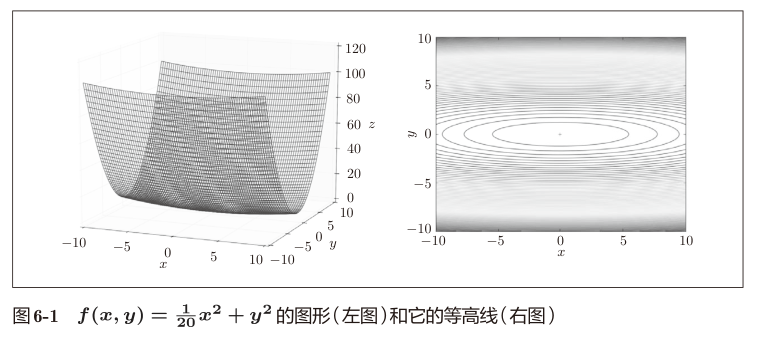

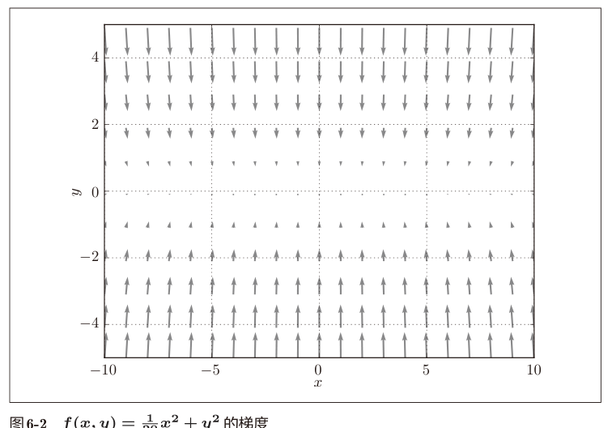

可以看到，我们知道鞍点是(0,0)但是在y轴大部分位置，指向的都是y=0，但来到y=0，坡度就小很多。总体来看，并不是所有的位置都明确指向(0,0)。在这个上面进行梯度下降，效率会比较低，得走一个“之”字形。

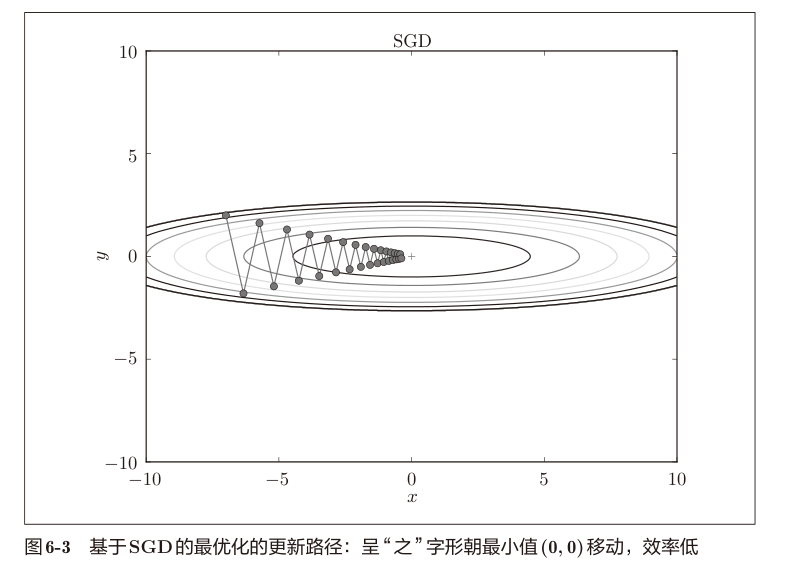

## Momentum

Momentum是“动量”，就是物理的那个。数学表示
$$
v\leftarrow\alpha v-\eta\frac{\partial L}{\partial W}\\
W\leftarrow W+v
$$
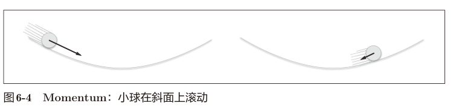

好像多了$\alpha v$这一项，承担减速的任务，类似于一种摩擦力或空气阻力了。（动量是mv吗）

```python
class Momentum:
    def __init__(self, lr=0.01, momentum=0.9):
        self.lr = lr
        self.momentum = momentum
        self.v = None

    def update(self, params, grads):
        if self.v is None:
            self.v = {}
            for key, val in params.items():
                self.v[key] = np.zeros_like(val) #维度一样的0矩阵
        for key in params.keys():
            self.v[key] = self.momentum * self.v[key] - self.lr * grads[key]
            params[key] += self.v[key]
```

写是这么写，但是看上去还是一知半解啊。

v这个参数会保存速度，一开始是个零矩阵，不过每次更新参数的同时，也会更新自己。这个怎么说呢，怎么感觉好像保留一部分之前的梯度一样。咱们看图

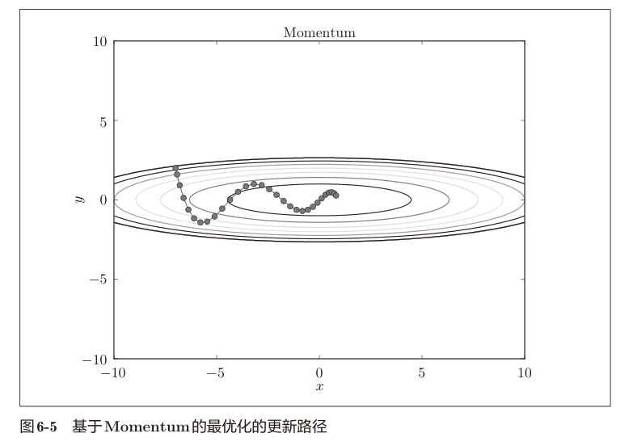

y轴上面本身就是互相抵消的，可能变化不大。但是x轴上加速度是不断累积的，所以更快地靠近了最低点。总体来看就是蜿蜒程度减小了。不错不错，妙啊。

> 我愿称之为，故意保留了大肠的原味。

## AdaGrad

学习率衰减（learning rate decay）：随着学习的进行，学习率逐渐减小。一开始多学，后面逐渐少学。

AdaGrad则会为每个元素适当地调整学习率（adaptive）。数学式
$$
\boldsymbol{h} \leftarrow \boldsymbol{h} + \frac{\partial L}{\partial \boldsymbol{W}} \odot \frac{\partial L}{\partial \boldsymbol{W}} \\
\boldsymbol{W} \leftarrow \boldsymbol{W} - \eta \frac{1}{\sqrt{\boldsymbol{h}}} \frac{\partial L}{\partial \boldsymbol{W}}
$$
其中h是一个新的变量h，保存了之前所有梯度值的平方和。$\odot$表示逐元素相乘。在更新函数的时候会除以这个根号h。也就是说，参数变动比较大的之后的学习率会变得更小。

> 看似很不错，但是随着学习的不断加深，好像更新量会趋近于0。这个问题可以用一个叫做RMSPro的方法。他会逐渐遗忘过去的梯度，更反映比较新的梯度。这种操作专业上称之为“指数移动平均”，即呈指数函数式减小过去梯度的尺度。

```python
class AdaGrad:
    def __init__(self, lr=0.01):
        self.lr = lr
        self.h = None
    
    def update(self, params, grads):
        if self.h is None:
            self.h = {}
            for key, val in params.items():
                self.h[key] = np.zeros_like(val)
    
        for key in params.keys():
            self.h[key] += grads[key] ** 2
            params[key] -= self.lr * grads[key] / (np.sqrt(self.h[key]) + 1e-7)
```

基本写法就这样。不过在最后除以根号h的同时还要补上一个微笑值，防止梯度变成0了。

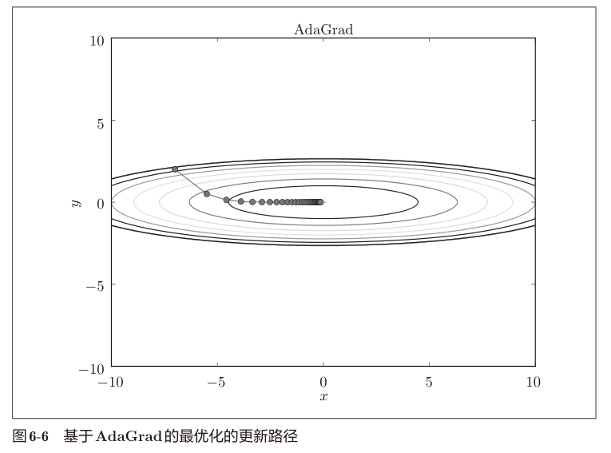

看上去的确是路径短了不少。

## Adam

Momentum动量法依据物理法则累积梯度，AdaGrad依据之前的梯度调整学习率，如果将其融合效果会不会更好呢？这就是Adam的思路。这是2015年的新方法，这本书直接不展示推导过程了。

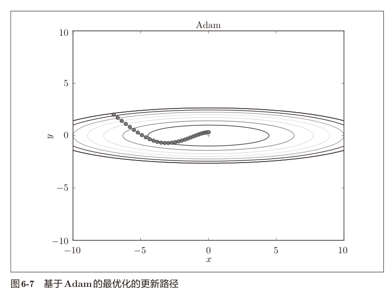

可以看到在y轴方向的抖动幅度降低了。说明确实是精进了不少。

> Adam会设置3个超参数。一个是学习率（论文中以α出现），另外两个是一次momentum系数β 1和二次momentum系数β 2。根据论文，标准的设定值是β 1为0.9，β 2 为0.999。设置了这些值后，大多数情况下都能顺利运行。

## 比较四种更新方法

SGD、Momentum、AdaGrad、Adam

各有各的特点，有擅长的也有不擅长的，很多仍在使用SGD，这本书应该是2018年的书，当时也很多人在用Adam法。（怪不得我之前看到机器学习也有好多Adaboost用在机器学习当中）

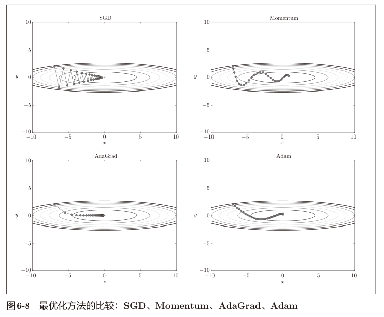

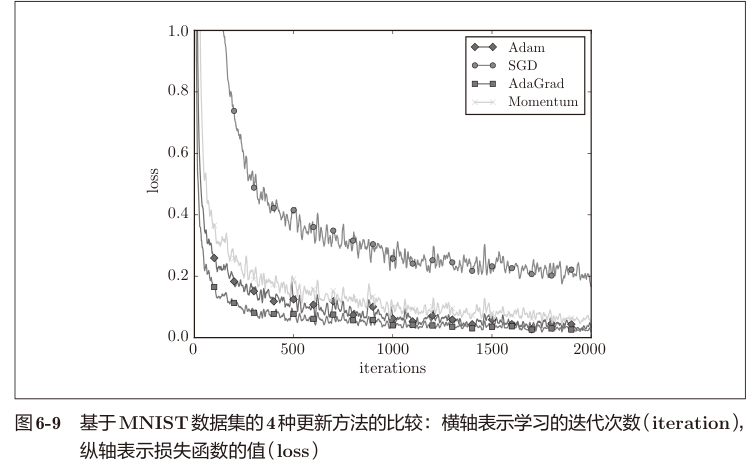

我就尝试了，作者使用了一个5层神经网络×100个神经元，用ReLU激活。这里可以看到还是AdaGrad学的快。

一般别的方法都会比SGD更快更准。

# 权重的初始值

## 当参数全为0时

权值衰减（weight decay）：以减小权重参数的值为目的进行学习的方法。通过减小权重参数的值来抑制过拟合的发生。

> 竟然还能不以降低损失函数为目的

所以一开始在代码就写了`0.01 * np.random.randn(10, 100)`，这个就是生成高斯分布随机数的百分之一大小的值。

那权重的值可以设置为0吗。那不行。输入权重都是0，给第二层那全都是b了。反向传播也是一样的值，学习率大家也都一样，那么就会同步更新了。所以还是得使用随机生成的值。

## 隐藏层激活值的分布

其实就是做了一个矩阵运算，不是真正意义上可以学习的神经网络。

构建了一个5层的神经网络，输入100变量的1000个数据，神经元也都是100，用sigmoid函数激活。将各层的激活值保存起来，然后绘制出频数直方图。

```python
import numpy as np
import matplotlib.pyplot as plt


def sigmoid(x):
    return 1 / (1 + np.exp(-x))


x = np.random.randn(1000, 100)#0-1的高斯分布
node_num = 100
hidden_layer_size = 5
activations = {}

for i in range(hidden_layer_size):
    if i != 0:
        x = activations[i-1]

    w = np.random.randn(node_num, node_num)*1

    z = np.dot(x, w)
    a = sigmoid(z)
    activations[i] = a

for i,a in activations.items():
    plt.subplot(1, len(activations), i+1)
    plt.title(str(i+1)+'-layer')
    plt.hist(a.flatten(), 30, range=(0,1))
plt.show()
```

代码是这么写的。

还是作者的图清爽一点。但是我的图更说明问题

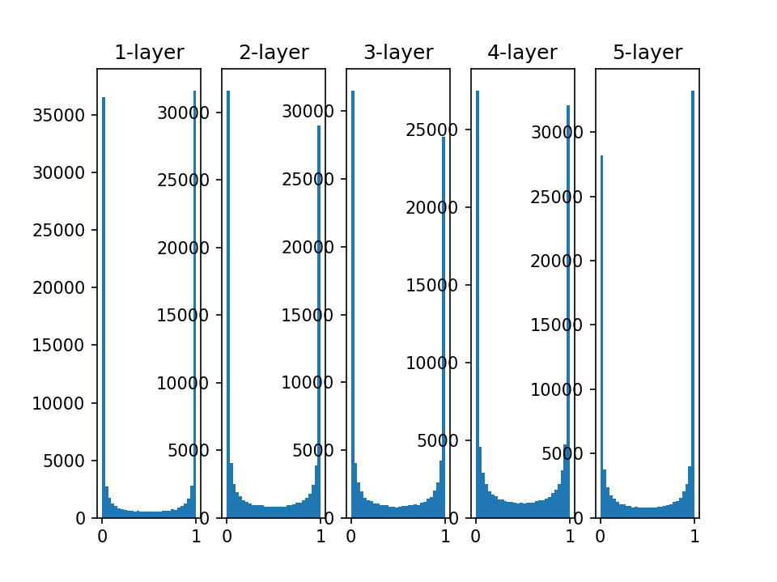

可以看到各层的激活值偏向0和1的分布，两头高，中间低。那是因为sigmoid函数是S型函数，在0和1的导数趋向于0。这就导致偏向0或1的数据分布会造成反向传播中梯度的值不断变小，然后消失。（复习一下sigmoid函数的导数表达式）
$$
\sigma^\prime(x)=\sigma(x)\cdot(1-\sigma(x))
$$
这个问题称之为**梯度消失**（gradient vanishing）

如果把高斯分布的值乘0.01呢

```python
    # w = np.random.randn(node_num, node_num)*1
    w = np.random.randn(node_num, node_num)*0.01
```

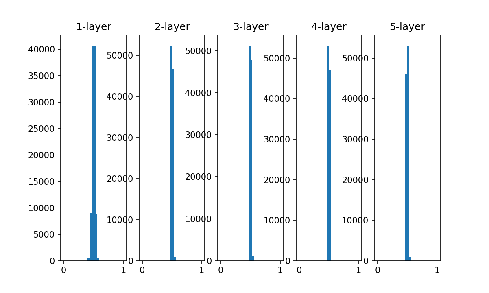

这会儿的梯度集中在0.5了，所以就不会发生梯度消失的问题。但是如果激活值都是差不多的值，那好像在表现力上有很大的问题。因为如果多个神经元都做一样的事情，那和一个神经元其实也没太多差别。因此激活值分布有所偏向也会遇到“表现力”受限的问题。这就要求各层的激活值分布有适当的广度。

这边作者推荐了一个Xavier初始值，现在这个初始值已经被作为标准使用了。为了使各层的激活具有相同广度的分布，推导出的结论是，如果前一层的节点数是$n$，那么初始值使用标准差为$\frac{1}{\sqrt{n}}$的分布。也就是说前一层的节点越多，这层权重尺度就越小。

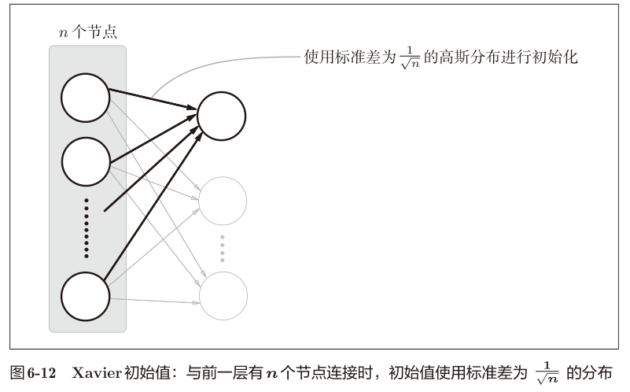

在代码上还是比较简单的

```python
    # w = np.random.randn(node_num, node_num)*1
    # w = np.random.randn(node_num, node_num)*0.01
    w = np.random.randn(node_num, node_num)/np.sqrt(node_num)
```

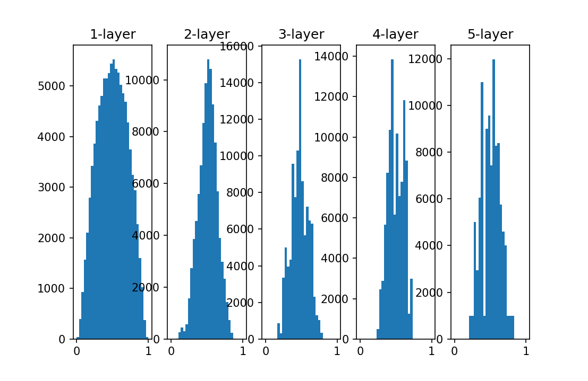

可以看到越到后面图像越歪斜。这个歪斜就是广度，不是说分布均匀就是广度，而是各个值都有大小不一不对称的分布，这样我们的激活函数的表现力就不受限制，可以进行更高效的学习。

> 还有一个tanh函数（双曲线函数）这本书好像还没说。据说这个歪斜就能得到改善。

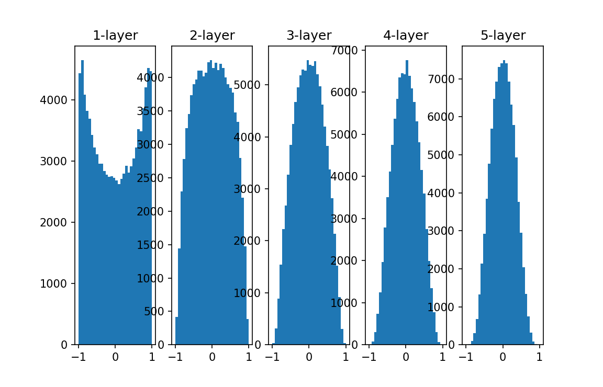

```python
# 用tanh函数
def tanh(x):
    return np.tanh(x)


# 使用tanh函数进行激活
for i in range(hidden_layer_size):
    if i != 0:
        x = activations[i-1]

    w = np.random.randn(node_num, node_num)/np.sqrt(node_num)

    z = np.dot(x, w)
    a = tanh(z)
    activations[i] = a
for i, a in activations.items():
    plt.subplot(1, len(activations), i+1)
    plt.title(str(i+1)+'-layer')
    plt.hist(a.flatten(), 30, range=(-1, 1))
plt.show()
```

## ReLU的权重初始值

Xavier初始值是以激活函数为线性函数为前提推导出来的。

话说sigmoid和tanh函数不是线性函数吧。但是作者说sigmoid和tanh在中央附近可以视作线性函数，所以适用Xavier初始值。但是这个小节讲的是ReLU函数，这个就真的很难视作线性函数了。

这里介绍了He初始值，当前一层节点数为$n$时，He初始值使用标准差为$\sqrt\frac{2}{n}$的高斯分布。从直观上解释那就是ReLU复制区域是0（降低了广度），所以需要Xavier初始值2倍的系数（话说不是根号2嘛）

```python
import numpy as np
import matplotlib.pyplot as plt


def ReLU(x):
    return np.maximum(0, x)


x = np.random.randn(1000, 100)
node_num = 100
hidden_layer_size = 5
activations = {}

for i in range(hidden_layer_size):
    if i != 0:
        x = activations[i-1]

    # w = np.random.randn(node_num, node_num)*0.01
    # w = np.random.randn(node_num, node_num)/np.sqrt(node_num)
    w = np.random.randn(node_num, node_num)/np.sqrt(node_num/2)

    z = np.dot(x, w)
    a = ReLU(z)
    activations[i] = a

for i, a in activations.items():
    plt.subplot(1, len(activations), i+1)
    plt.title(str(i+1)+'-layer')
    plt.hist(a.flatten(), 30, range=(0, 1))
plt.show()

```

代码放这了，但是图还是看作者的吧，人家进行了修改更美观。

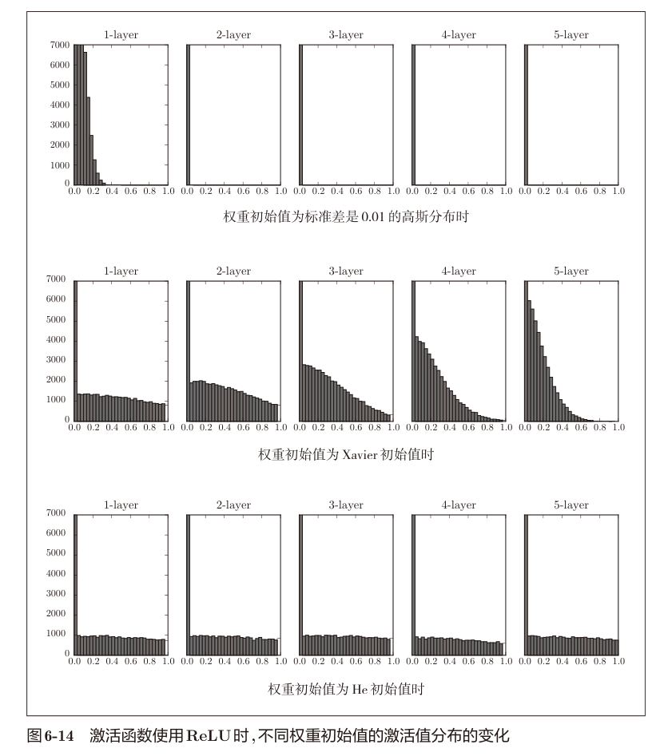

可以看到标准差还是0.01，各层的 激活值都很小，说明逆向传播的时候权重的梯度很小，学习进度不大。而Xavier初始值随着层数加深，偏向性也越来越明显，最后也难免出现梯度消失的情况。只有He初始值一直保持一定广度。

> 总而言之，这里也要像医考帮一样一个评论性总结。
>
> 激活函数ReLU，权重初始值使用He
>
> 激活函数sigmoid或tanh等S型曲线，权重初始值使用Xavier

## MNIST比较初始值的差异

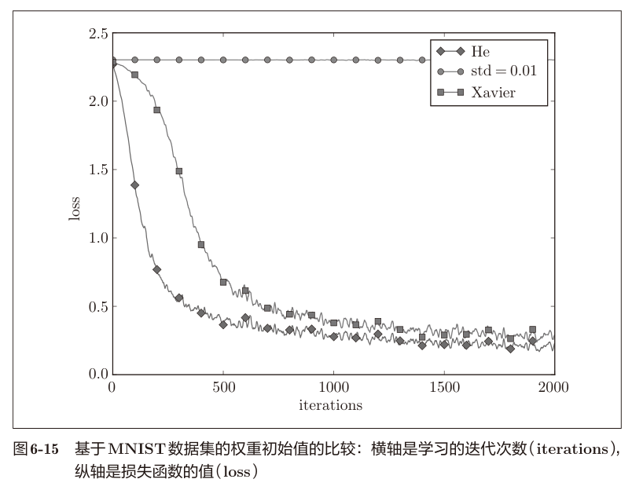

这里是5层神经网络，各100个神经元，ReLU激活。标准差是0.01就无法学习（因为梯度都是0了）。但是使用Xavier和He，就能顺利学习，并且He学的更快。

> 感觉初始值分布广相当于知道变通，分布不广就不知变通，学多少遍还是一样。

# Batch Normalization

这也是2015（对作者成书而言当然是新方法，但是在现在已经是10年了）

Batch Normalization的想法是强制性调整激活值的分布。具有以下优点

- 可以使学习快速进行（增大学习率）
- 不那么依赖初始值（不用机械设定初始值）
- 抑制过拟合（降低Dropout等必要性）

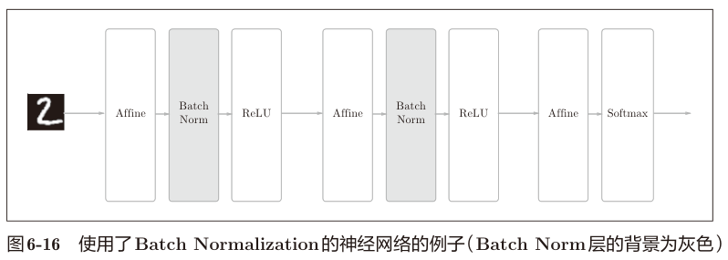

这就加入了一层正规化层，Batch Normalization层，顾名思义就是按照mini-batch进行正规化。就是对数据进行分布均值为0，方差为1的正规化。
$$
\begin{align}
\mu_B&\leftarrow \frac{1}{m}\displaystyle\sum^m_{i=1}x_i\\
\sigma^2_B&\leftarrow \frac{1}{m}\displaystyle\sum^m_{i=1}(x_i-\mu_B)^2\\
\hat{x}_i&\leftarrow\frac{x_i-\mu_B}{\sqrt{\sigma^2_B+\varepsilon}}
\end{align}
$$
其实就是求出均数，然后标准差，然后让所有值减去均数，然后除以标准差，为了防止标准差为0的情况，所以加上了一个$\varepsilon$微小值放置除0。这样可以减小数据的偏向。不过Batch Norm层还会进行缩放和平移变换。
$$
y_i\leftarrow\gamma\hat{x}_i+\beta
$$
这个$\gamma$和$\beta$一开始是1和0，然后也会通过学习进行调整到合适的值。

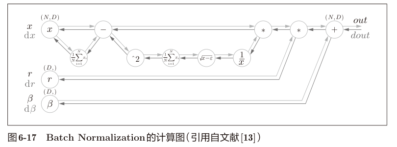

理念很简单，但是反向传播推导好像不是那么简单。

随便找一个，可以看到这个表达式还是蛮复杂的哦，而且每个人的推导过程都不一样，几乎没有用计算图的

https://zhuanlan.zhihu.com/p/161043998

https://mp.weixin.qq.com/s/t1ksbYC9ffwMxCIa3YQBxg

算了暂时先理解到这就完事了。我们也可以记录一下相关的反向传播推导的结果。

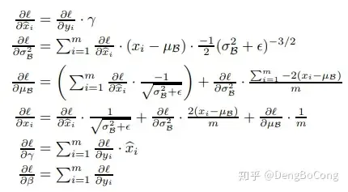
$$
\frac{\partial \mathcal{L}}{\partial x_i} = \frac{1}{\sqrt{\sigma_{\mathcal{B}}^2 + \epsilon}} \cdot \frac{\partial \mathcal{L}}{\partial \hat{x}_i} + \frac{1}{m} \cdot \frac{\partial \mathcal{L}}{\partial \mu_{\mathcal{B}}} + \frac{2}{m} (x_i - \mu_{\mathcal{B}}) \cdot \frac{\partial \mathcal{L}}{\partial \sigma_{\mathcal{B}}^2}\\
% 损失函数对β的偏导数
\frac{\partial \mathcal{L}}{\partial \beta} = \sum_{i=1}^{m} \frac{\partial \mathcal{L}}{\partial y_i}\\

% 损失函数对γ的偏导数
\frac{\partial \mathcal{L}}{\partial \gamma} = \sum_{i=1}^{m} \frac{\partial \mathcal{L}}{\partial y_i} \cdot \hat{x}_i
$$
先这样吧，这个表示起来还是比较复杂的。

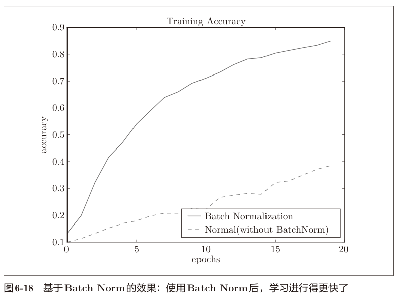

说实话我不是很想使用作者的脚本，因为数据下载不来的。

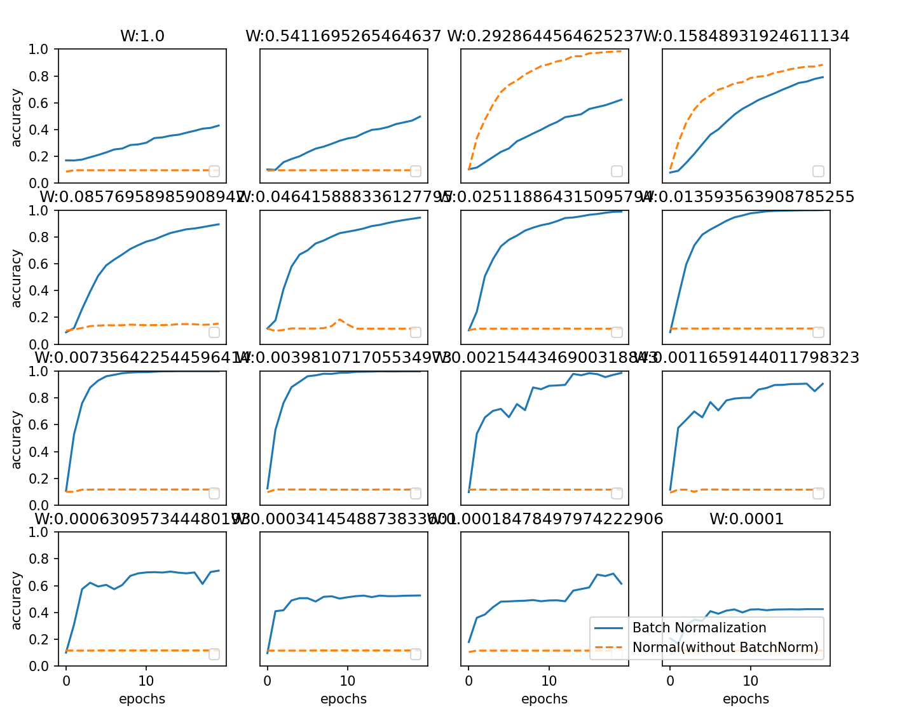

不过最后得到的是这么个玩意儿，难道训练了16次？应该是按照不同权重。不过追溯这个w的作用，实在是看不懂啊。感觉超纲了。反正大部分情况都是使用BN之后学习速度更快。这个w应该是影响初始值的。太大太小都不行。我们知道太大不收敛，太小不学习。所以这也侧面证明BN不依赖初始值。

# 正则化

过拟合：只能拟合训练数据，但是不能很好拟合包含在训练数据中其他数据的状态。但是机器学习的目的还是能提高泛化能力。

## 过拟合

过拟合的原因：

- 模型拥有大量参数，表现力强
- 训练数据少

这里就故意满足两个条件，看看过拟合会不会形成。

MNIST数据60000个只学300个，然后7层网络（100个神经元，ReLU激活）

> 我说怎么这么慢，那是因为AI给我设定为数值差分了。

```python
import numpy as np
import sys
import os
import matplotlib.pyplot as plt
# fmt:off
sys.path.append(os.pardir)
from dataset.mnist import load_mnist
from common.multi_layer_net import *
from common.optimizer import SGD
# fmt:on

(x_train, t_train), (x_test, t_test) = load_mnist(normalize=True)
x_train = x_train[:300]
t_train = t_train[:300]

network = MultiLayerNet(input_size=784, hidden_size_list=[
                        100, 100, 100, 100, 100, 100], output_size=10)
optimizer = SGD(lr=0.01)

max_epochs = 201
train_size = x_train.shape[0]
batch_size = 100

train_loss_list = []
train_acc_list = []
test_acc_list = []

iter_per_epoch = max(train_size / batch_size, 1)
epoch_cnt = 0

for i in range(1000000000):
    batch_mask = np.random.choice(train_size, batch_size)
    x_batch = x_train[batch_mask]
    t_batch = t_train[batch_mask]

    grads = network.gradient(x_batch, t_batch)
    optimizer.update(network.params, grads)

    if i % iter_per_epoch == 0:
        train_acc = network.accuracy(x_train, t_train)
        test_acc = network.accuracy(x_test, t_test)
        train_acc_list.append(train_acc)
        test_acc_list.append(test_acc)
        print(
            f"epoch: {epoch_cnt}, train acc: {train_acc}, test acc: {test_acc}")

        epoch_cnt += 1
        if epoch_cnt >= max_epochs:
            break

# 同时绘制训练数据和测试数据accuracy的变化
plt.plot(train_acc_list, label='train acc')
plt.plot(test_acc_list, label='test acc')
plt.legend()
plt.show()
```

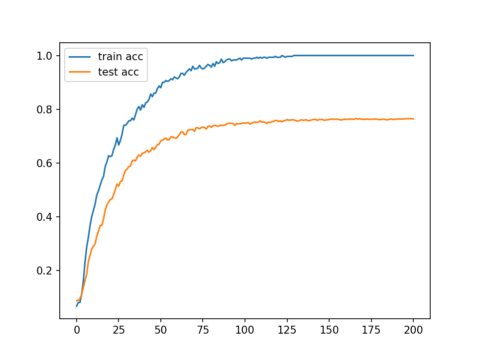

可以看到100epoch之后，训练数据都是100%了，但是测试数据也已经到达了基线。

## 权值衰减

**权重衰减**通过在学习过程中对最大的权重进行惩罚，来抑制过拟合。因为很多过拟合原本就是因为权重参数取值过大才发生的。

神经网络的学习目的是减小损失函数的值，如果让损失函数加上权重的平方范数（L2范数），这样就可以抑制权重变大。权重$W$L2范数的权值衰减就是$\frac{1}{2}\lambda W^2$。其中$\lambda$又是一个控制正则化强度的超参数，这个值越大，对权重十佳的乘法就越重。而前面的1/2是为了求导的时候有个一个整数。

> 尴尬了，数学太差没学过L2范数啊。需要恶补一下。
>
> 对于一个 n 维向量 $\mathbf{x} = (x_1, x_2, \dots, x_n)$，L2范数的值是$\|\mathbf{x}\|_2 = \sqrt{x_1^2 + x_2^2 + \dots + x_n^2}$。
>
> L1范数是绝对值之和： $\|\mathbf{x}\|_1 = |x_1| + |x_2| + \dots + |x_n|$。
>
> 据说还有L$\infin$范数，即最大绝对值。都可以作为正则化项。

幸运的是，在作者提供的神经网络隐藏层代码中的损失函数包含了这个权值衰减的项，只不过一般设置λ都是0，这里我们多写一行。

```python
network = MultiLayerNet(input_size=784, hidden_size_list=[
                        100, 100, 100, 100, 100, 100], output_size=10)
network.weight_decay_lambda = 0.1
#其实也可以直接写在类的参数里面
```

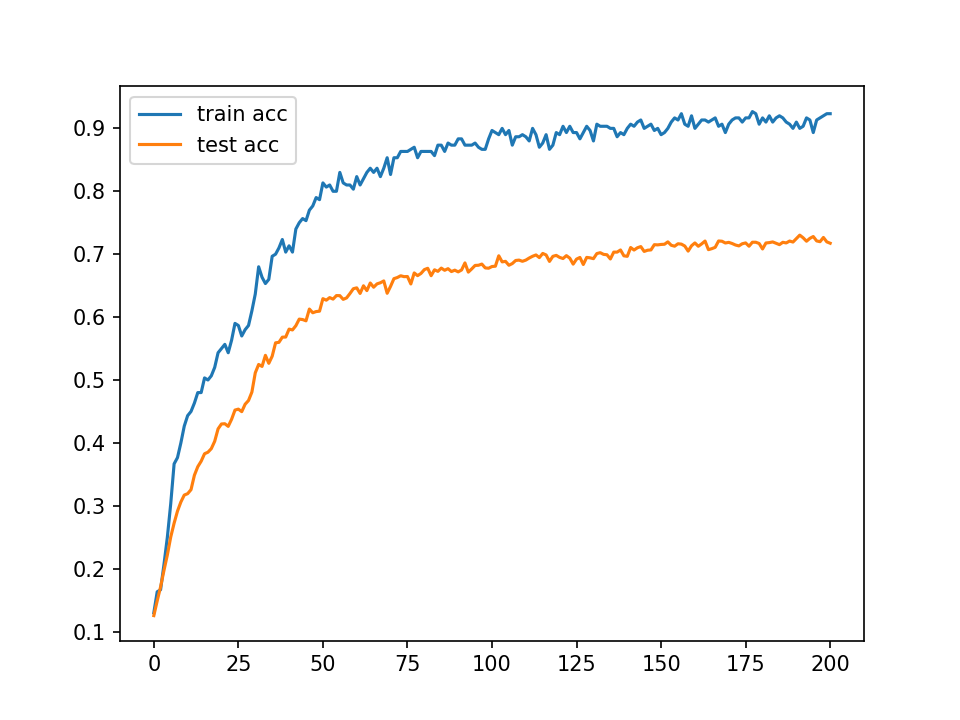

结果确实有一点不一样，但是说实话我这里好像差别不大的样子。

## Dropout

权值衰减实现比较简单，但是复杂的模型难以应对。

Dropout：是一种在学习的过程中随机删除神经元的方法。

> 训练时，每传递一次数据，就会随机选择要删除的神经元。然后，测试时，虽然会传递所有的神经元信号，但是对于各个神经元的输出，要乘上训练时的删除比例后再输出。
>
> 因为训练时如果进行恰当的计算的话，正向传播时单纯地传递数据就可以了（不用乘
> 以删除比例）

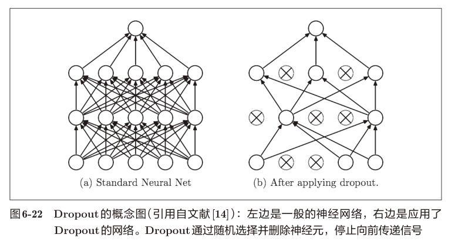

我也是看了好久才懂这句话，其实背后的意思是说，删除了神经元之后，应该进行一定程度的复原，乘以删除比例的倒数，保持期望不变。但是在实际学习过程中为了简便一点，实际删除就完事了，不用管这么多。不过最后推理的时候应该还是要乘回来的。

```python
class Dropout:
    def __init__(self, dropout_ratio=0.5):
        self.dropout_ratio = dropout_ratio
        self.mask = None
    
    def forward(self, x, train_flg=True):
        if train_flg:
            self.mask = np.random.rand(*x.shape) > self.dropout_ratio
            return x * self.mask
        else:
            return x * (1.0 - self.dropout_ratio)
    
    def backward(self, dout):
        return dout * self.mask
```

我去，这个代码写的好优雅啊。`*x.shape`是一种解包的用法，比如一个`(100,200)`可以直接给外面一个`100,200`。然后mask会输出一个逻辑值矩阵，然后通过相乘保留设定比例的原本输入。反向传播也一样，删除的也不继续算下去了。

但是这个设置了一个Dropout的类，要怎么使用呢？可能是类中类了吧，因为forward和backward都算在内了。

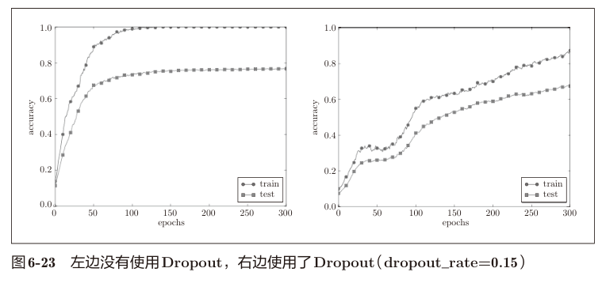

可以看到，Dropout也可以在一定程度上抑制过拟合。

这里又涉及一个集成学习的概念。**集成学习**就是让多个模型单独进行学习，推理时候取多个模型的平均值，一般集成学习的精度可以提高一些。而Dropout可以理解为每次都让不同的模型进行学习。而且推理的时候，乘以输出比例，也可以当做是取得模型平均值的过程。总的来说就是Dropout将集成学习的效果（模拟地）通过一个网络实现了。

# 超参数的验证

## 分割验证数据

**超参数**（hyper-parameter）：**在模型训练开始前需要人为设定的参数**，其值不能通过模型训练过程自动学习得到，而是需要通过经验、实验或特定方法（如网格搜索、随机搜索）来确定。比如

- 隐藏层的数量和每层神经元的数量
- 学习率（learning rate）
- 批大小（batch size）
- 迭代次数（epochs）
- 激活函数的选择（如 ReLU、Sigmoid）
- 正则化系数（如 L2 正则中的 λ）

特征：预先设定，不可通过训练学习，影响模型性能。

一个非常重要的点就是不能使用测试数据评估超参数的性能。因为如果根据测试数据调整超参数，某种意义上也是一种过拟合，人为造成的。这样就在无形之中降低了模型的泛化能力了。

> 也不是一次都不能使用，为了确认泛化能力，最后敲定的时候使用一次测试数据

这个时候用于调整超参数的数据称之为**验证数据**（validation data）

```python
import os
import sys
import numpy as np
#fmt: off
sys.path.append(os.pardir)
from dataset.mnist import load_mnist
#fmt: on


# 打乱数据的函数
def shuffle_dataset(x, t):
    permutation = np.random.permutation(x.shape[0])
    x = x[permutation, :] if x.ndim == 2 else x[permutation, :, :, :]
    t = t[permutation]

    return x, t


(x_train, t_train), (x_test, t_test) = load_mnist()

# 打乱训练数据
x_train, t_train = shuffle_dataset(x_train, t_train)

# 分割验证数据
validation_rate = 0.2
validation_num = int(x_train.shape[0] * validation_rate)

x_val = x_train[:validation_num]
t_val = t_train[:validation_num]
x_train = x_train[validation_num:]
t_train = t_train[validation_num:]
```

这里我扒来了`utils.py`里的`shuffle_dataset`函数，然后后面的代码还是容易看懂的。（但是好像不像作者说的使用了`np.random.shuffle`这个函数啊）

在这里分割训练数据前，事先打乱了数据和教师标签（原来这里t是教师的意思），因为数据很有可能是按照某个偏向编写的（比如0到9）。

## 超参数最优化

有人说随机随机采样的搜索方式效果比网格搜索这种有规律的搜索效果更好。

先设定一个超参数的范围，大致指定就好。不一定是线性的指定，也可以使用对数尺度指定。比如0.001到1000这样子。

因为超参数优化每次都算一次学习，比较费时间，可以减少学习的epoch，缩短一次评估需要的时间。

基本步骤是

**步骤0**
设定超参数的范围。

**步骤1**
从设定的超参数范围中随机采样。

**步骤2**
使用步骤1中采样到的超参数的值进行学习，通过验证数据评估识别精
度（但是要将epoch设置得很小）。

**步骤3**
重复步骤1和步骤2（100次等），根据它们的识别精度的结果，缩小超参
数的范围。

> 这种方法是实践性的方法。据说还有**贝叶斯最优化**(Bayesian optimization)可以进行更加严密高效地进行最优化。

这里仅对学习率和权值衰减系数进行搜索

```python
weight_decay = 10 ** np.random.uniform(-8, -4)
lr = 10 ** np.random.uniform(-6, -2)
```

这边作者直接不展示代码了，因为比较长，而且费时间

```python
# coding: utf-8
import sys
import os
import numpy as np
import matplotlib.pyplot as plt
# fmt: off
sys.path.append(os.pardir)  # 为了导入父目录的文件而进行的设定
from dataset.mnist import load_mnist
from common.multi_layer_net import MultiLayerNet
from common.util import shuffle_dataset
from common.trainer import Trainer
# fmt: on

(x_train, t_train), (x_test, t_test) = load_mnist(normalize=True)

# 为了实现高速化，减少训练数据
x_train = x_train[:500]
t_train = t_train[:500]

# 分割验证数据
validation_rate = 0.20
validation_num = int(x_train.shape[0] * validation_rate)
x_train, t_train = shuffle_dataset(x_train, t_train)
x_val = x_train[:validation_num]
t_val = t_train[:validation_num]
x_train = x_train[validation_num:]
t_train = t_train[validation_num:]


def __train(lr, weight_decay, epocs=50):
    network = MultiLayerNet(input_size=784, hidden_size_list=[100, 100, 100, 100, 100, 100],
                            output_size=10, weight_decay_lambda=weight_decay)
    trainer = Trainer(network, x_train, t_train, x_val, t_val,
                      epochs=epocs, mini_batch_size=100,
                      optimizer='sgd', optimizer_param={'lr': lr}, verbose=False)
    trainer.train()

    return trainer.test_acc_list, trainer.train_acc_list


# 超参数的随机搜索======================================
optimization_trial = 100
results_val = {}
results_train = {}
for _ in range(optimization_trial):
    # 指定搜索的超参数的范围===============
    weight_decay = 10 ** np.random.uniform(-8, -4)
    lr = 10 ** np.random.uniform(-6, -2)
    # ================================================

    val_acc_list, train_acc_list = __train(lr, weight_decay)
    print("val acc:" + str(val_acc_list[-1]) + " | lr:" +
          str(lr) + ", weight decay:" + str(weight_decay))
    key = "lr:" + str(lr) + ", weight decay:" + str(weight_decay)
    results_val[key] = val_acc_list
    results_train[key] = train_acc_list

# 绘制图形========================================================
print("=========== Hyper-Parameter Optimization Result ===========")
graph_draw_num = 20
col_num = 5
row_num = int(np.ceil(graph_draw_num / col_num))
i = 0

for key, val_acc_list in sorted(results_val.items(), key=lambda x: x[1][-1], reverse=True):
    print("Best-" + str(i+1) + "(val acc:" +
          str(val_acc_list[-1]) + ") | " + key)

    plt.subplot(row_num, col_num, i+1)
    plt.title("Best-" + str(i+1))
    plt.ylim(0.0, 1.0)
    if i % 5:
        plt.yticks([])
    plt.xticks([])
    x = np.arange(len(val_acc_list))
    plt.plot(x, val_acc_list)
    plt.plot(x, results_train[key], "--")
    i += 1

    if i >= graph_draw_num:
        break

plt.show()
```

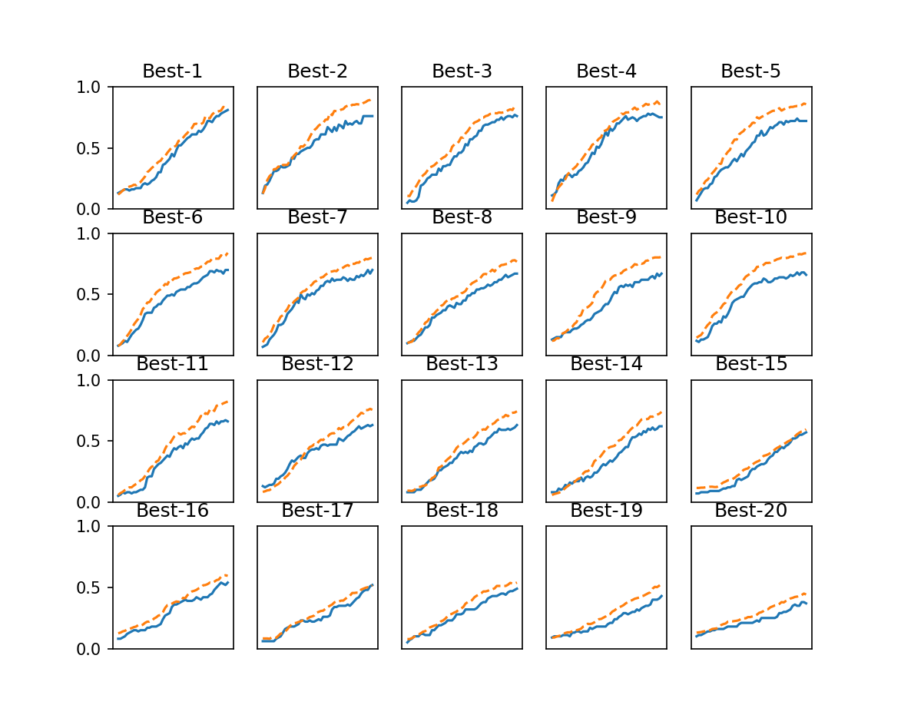

我也得到了结果。但是我这个代码有记录最佳的参数吗。哇去，竟然记录在acc_list的key里面。哦作者自己写了。不过我们得简单修改一下

```python
i = 0
for key, val_acc_list in sorted(results_val.items(), key=lambda x: x[1][-1], reverse=True):
    print("Best-" + str(i+1) + "(val acc:" +
          str(val_acc_list[-1]) + ") | " + key)

    i += 1

    if i >= graph_draw_num:
        break
```

这样就好了。

```
Best-1(val acc:0.81) | lr:0.007754121773252743, weight decay:3.1116455260643335e-08
Best-2(val acc:0.76) | lr:0.007388117483388022, weight decay:7.223054963048641e-06
Best-3(val acc:0.76) | lr:0.005450057953149397, weight decay:1.1263126618545874e-05
Best-4(val acc:0.75) | lr:0.0098828569064998, weight decay:1.816614231254324e-05
Best-5(val acc:0.72) | lr:0.006422237977799368, weight decay:9.118405033221008e-06
```

可以看到确实找到了一个还算过得去的超参数。

# 小结

下一章就学习CNN卷积神经网络了。那我们之前学的叫啥神经网络呢？