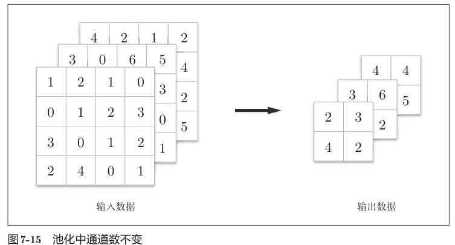
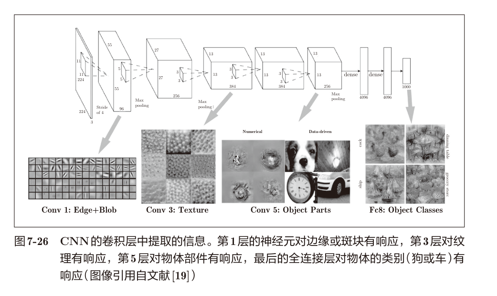

# 前言

我猜前面应该就是ANN人工神经网络，基础款的。这一章学的卷积神经网络。话说我们之前的基础都不牢靠，学这个真的是没有问题吗，估计也是numpy手搓的。了解一下原理好了。

# 整体结构

全连接fully-connected：相邻层的所有神经元之间都有连接


这里用affine层实现的全连接，可以这么表示。然后affine层后面跟着ReLU激活函数层。最后是softmax输出。


CNN新增了Convolution层和Pooling层，连接顺序就是 卷积-ReLU-池化（有时池化层会被省略）。不过需要注意的是，靠近输出的层用的还是之前的Affine-ReLU组合以及Softmax输出。

# 卷积层

全连接相邻神经元全部连接，输出数量可以任意决定。

问题：忽略了数据的形状，因为所有数据都被摊平成为一维的向量了。但是图像通常是长、宽、通道的三维形状。全连接忽视了数据之间的空间信息。

卷积层则可以保持形状不变。

**特征图（feature map）**：卷积层的输入输出数据。输入就是输入特征图，输出就是输出特征图。

## 卷积运算

卷积运算类似于图像处理中的滤波器运算。


输入数据是一个二维的数据，滤波器也是一个二维的数据。（有的地方也会用“核”表示滤波器）。


卷积运算就是按照一定的间隔滑动滤波器窗口，然后将滤波器元素和输入数据对应位置的像素相乘后求和（有时成为乘积累加运算）。算完后保存在输出数据的对应位置。这里滤波器里面的元素，对应的就是之前全连接的权重参数，而且也可以有偏置（全部算完加一下就好了，也就是说偏置通常就是1×1的）。


## 填充

**填充（padding）**：在卷积运算之前，需要向输入数据周围填入固定的数据（比如0）

幅度：填入了几圈


通过向4×4的输入特征图进行幅度为1的填充（成为了6×6的输入），然后再让3×3的滤波器进行卷积运算，最后得到的输出还是4×4了。

> 使用填充的目的就是为了调整输出的大小。如果进行反复多次卷积运算，最后数据越来越小就会变成1，无法进行卷积了。使用填充就可以避免这个问题。
>
> 那话说，如果是4×4的输入，2×2的滤波器，那输出应该是3×3，这样怎么填充呢。填充为1，那输出就是5×5了。反而变大了不是吗。

## 步幅

**步幅（stride）**：滤波器移动的位置间隔就是步幅。

前面的例子步幅是1，一格一格移动。


这个就是个步幅为2的例子。7×7的，应用3×3的滤波器，步幅为1那就是5×5，步幅为2就是3×3

> 那如果遇到步幅和滤波器长度和输入数据不匹配怎么办呢？是省略了吗。

输入、步幅、填充、输出，这几个数据的关系是什么呢？

假设输入大小为$(H,W)$，滤波器大小为$(FH,FW)$，输出大小事$(OH,OW)$，填充是$P$，步幅是$S$，那么输出可以表示为
$$
OH=\frac{H+2P-FH}{S}+1\\
OW=\frac{W+2P-FW}{S}+1
$$

> 输入大小：(4, 4)；填充：1；步幅：1；滤波器大小：(3, 3)
>
> 输入大小：(7, 7)；填充：0；步幅：2；滤波器大小：(3, 3)
>
> 输入大小：(28, 31)；填充：2；步幅：3；滤波器大小：(5, 5)

这些都是刚好能除尽的例子。但是如果随便取，就会遇到除不尽的情况，可能就得学会报错。但是有的时候肯呢个就会进行四舍五入（舍还好说，入难道是临时局部填充嘛？）

## 3维数据的卷积运算


输入数据和滤波器都是3维数据，长宽不一样，但是通道是一样的。所以最后的输出竟然还是一个2维的。


这里3维数据的卷积运算，输入和滤波器的通道数需要设为相同的值，这里都是3。

滤波器的长宽随便。不过滤波器内每个通道的大小还是要一致的。

当做方块就好理解一些了。


那要是想要输出数据也变成长方块怎么办？（我还以为是设置一个小的滤波器方块呢））没想到是使用多个滤波器，大小不变，但是里面参数改变一下就好了。（这个时候滤波器就变成4维了


写法是（滤波器数，通道，高，宽）

整合起来这个卷积运算的流程就是这样的


## 批处理

各层传递的也是4维数据了


总的来说就是将N次处理汇总成1次进行。

# 池化层

**池化**：缩小高、长方向上的空间运算。


这个例子就是按照步幅为2,2×2的Max池化的处理。所谓Max池化指的是获取最大值。2×2表示的是目标区域的大小。一般来说，<u>池化的窗口大小和步幅一致（窗口不重叠了就是说）</u>

> Max池化，目标区域取最大值，图像识别领域多用。
>
> Average池化，目标区域的平均值，这本书说到的池化层大多指这个。

**池化的特征**

- 没有要学习的参数：只取值，不多算
- 通道数不发生变化：按通道独立进行计算
- 对微小的位置变化具有鲁棒性（健壮）：数据的微小变差，池化结果没变




# 卷积层和池化层的实现

## 4维数组

R语言里面好像没有四维数组，numpy要使用四维数组的方式是

```
>>> x = np.random.rand(10, 1, 28, 28) # 随机生成数据
>>> x.shape
(10, 1, 28, 28)
```

访问第一个数据

```
>>> x[0].shape # (1, 28, 28)
>>> x[1].shape # (1, 28, 28)
```

访问第一个数据的第一个通道的空间数据

```
>>> x[0, 0] # 或者x[0][0]
```

其实还是浅显易懂的。就是你知道每个位置参数的意义

（序号，通道，高，长）

## im2col的展开

im2col可以将数据展开以适应滤波器（权重）

> 其实在一个滤波器内的空间反而没有那么重要。因此可以自由展开，只要对应滤波器的权重顺序即可。
>
> im2col 是 image to column”的缩写

那究竟是怎么展开的呢？


便于观察，步幅设置成窗宽（不重叠）（实际卷积层多半是会重叠的，因此展开后形成的im2col元素会很多重复的，不要慌）（尽管消耗了更多的内存，但是也更方便计算机计算


滤波器也可以转为一维的，组合成一个二维的进行矩阵计算。得到的计算结果经过整理就能还原出原本的卷积结果。

## 卷积层的实现

im2col只要知道了滤波器的长和高，然后步幅以及填充，就可以对输入数据进行转换

> im2col (input_data, filter_h, filter_w, stride=1, pad=0)
> • input_data―由（数据量，通道，高，长）的4维数组构成的输入数据
> • filter_h―滤波器的高
> • filter_w―滤波器的长
> • stride―步幅
> • pad―填充

```python
import sys
import os
import numpy as np
sys.path.append(os.pardir)
# fmt:off
from common.util import im2col
# fmt:on

x1 = np.random.rand(1, 3, 7, 7)
col1 = im2col(x1, 5, 5, stride=1, pad=0)
print(col1.shape)

x2 = np.random.rand(10, 3, 7, 7)
col2 = im2col(x2, 5, 5, stride=1, pad=0)
print(col2.shape)
```

这个例子自己也能推算

批大小时1，通道为3的，7×7数据，滤波器的3,5,5的，因此一个col就是75，然后根据步幅长和高都是3步，那么可以得到9个col

当批为10的时候，col的个数乘10，就是90个col

那卷积层的函数怎么写

```python
class Convolution:
    def __init__(self, W, b, stride=1, pad=0):
        self.W = W
        self.b = b
        self.stride = stride
        self.pad = pad

    def forward(self, x):
        FN, C, FH, FW = self.W.shape
        N, C, H, W = x.shape
        out_h = int(1 + (H + 2 * self.pad - FH) / self.stride)
        out_w = int(1 + (W + 2 * self.pad - FW) / self.stride)

        col = im2col(x, FH, FW, self.stride, self.pad)
        col_W = self.W.reshape(FN, -1).T
        out = np.dot(col, col_W) + self.b

        out = out.reshape(N, out_h, out_w, -1).transpose(0, 3, 1, 2)

        return out
```

比较难理解的就是结果的重新整理

> 1. **`reshape(N, out_h, out_w, -1)`**
>    - 将张量 `out` 重塑为 **4维张量**，维度顺序为 `(N, out_h, out_w, C)`。
>    - 参数含义：
>      - `N`：通常表示 **批次大小**（batch size）；
>      - `out_h`/`out_w`：表示特征图的 **高度** 和 **宽度**；
>      - `-1`：自动计算该维度的大小（根据张量总元素数和其他维度确定），这里会得到 **通道数** `C`（特征图的通道维度）。
> 2. **`transpose(0, 3, 1, 2)`**
>    - 对重塑后的 4 维张量进行 **维度转置**，将维度顺序从 `(N, out_h, out_w, C)` 调整为 `(N, C, out_h, out_w)`。
>    - 转置逻辑：原维度索引 `0→N`、`1→out_h`、`2→out_w`、`3→C`，转置后新维度顺序为 `0（N）、3（C）、1（out_h）、2（out_w）`。
>
> 将张量从 **`(N, H, W, C)` 格式**（批次、高度、宽度、通道，常见于 TensorFlow 等框架）转换为 **`(N, C, H, W)` 格式**（批次、通道、高度、宽度，常见于 PyTorch 等框架），以适配不同深度学习框架或算子对特征图维度顺序的要求。


就是这个意思，虽然可能形式不变，实际我们可以通过修改索引的顺序，更改成更为通用的表示方法。

那反向传播呢？我有点想不起来affine层，那不是加法不变，乘法替换嘛。那好像卷积层的窗的局部是affine层。不知道全层的反向传播是怎么计算的。。。所以还是要rethinkfun重学一下。。

这本书并没有讲，只是提供了一个col2lim函数。

> 除了使用 col2im这一点，卷积层的反向传播和Affine层的实现方式都一样。

估计是生成col之后可以当成affine层计算偏导数。

## 实现池化层

池化层的特点就是通道数不变，所以一个col只能包含一个通道（池化的应用区域安通道单独展开


展开之后（方便线性计算），求各行的最大值，然后再转换为矩阵形式即可


```python
class Pooling:
    def __init__(self, pool_h, pool_w, stride=1, pad=0):
        self.pool_h = pool_h
        self.pool_w = pool_w
        self.stride = stride
        self.pad = pad

    def forward(self, x):
        N, C, H, W = x.shape
        out_h = int(1 + (H - self.pool_h) / self.stride)
        out_w = int(1 + (W - self.pool_w) / self.stride)

        col = im2col(x,self.pool_h,self.pool_w,self.stride,self.pad)
        col = col.reshape(-1, self.pool_h * self.pool_w)

        out = np.max(col, axis=1)
        out = out.reshape(N, out_h, out_w, C).transpose(0, 3, 1, 2)

        return out
```

im2col比较激进，把不同通道的也放在一个col了，这个时候就需要reshape把每个col的长度设置为一个通道的h×w，这样就归还了每个通道的窗口了。

# CNN的实现

咱们这里要简单实现一个简单的CNN。包括一个卷积，一个全连接，一个输出


完整的代码是这么写的

```python
class SimpleConvNet:
    def __init__(self,input_dim=(1,28,28),
                 conv_param={'filter_num':30,'filter_size':5,'pad':0,'stride':1},
                 hidden_size=100,
                 output_size=10,
                 weight_init_std=0.01):
        filter_num = conv_param['filter_num']
        filter_size = conv_param['filter_size']
        filter_pad = conv_param['pad']
        filter_stride = conv_param['stride']
        input_size = input_dim[1]
        conv_output_size = (input_size - filter_size + 2*filter_pad) // filter_stride + 1
        pool_output_size = int(filter_num * (conv_output_size/2) * (conv_output_size/2))

        self.params = {}
        self.params['W1'] = weight_init_std * np.random.randn(filter_num,input_dim[0],filter_size,filter_size)
        self.params['b1'] = np.zeros(filter_num)
        self.params['W2'] = weight_init_std * np.random.randn(pool_output_size,hidden_size)
        self.params['b2'] = np.zeros(hidden_size)
        self.params['W3'] = weight_init_std * np.random.randn(hidden_size,output_size)
        self.params['b3'] = np.zeros(output_size)

        self.layers = OrderedDict()
        self.layers['Conv1'] = Convolution(self.params['W1'],self.params['b1'],conv_param['stride'],conv_param['pad'])
        self.layers['Pool1'] = Pooling(pool_h=2,pool_w=2,stride=2)
        self.layers['Affine1'] = Affine(self.params['W2'],self.params['b2'])
        self.layers['Relu1'] = Relu()
        self.layers['Affine2'] = Affine(self.params['W3'],self.params['b3'])
        self.last_layer = SoftmaxWithLoss()

    def predict(self,x):
        for layer in self.layers.values():
            x = layer.forward(x)
        return x
    
    def loss(self,x,t):
        y = self.predict(x)
        return self.last_layer.forward(y,t)

    def gradient(self,x,t):
        self.loss(x,t)

        dout = 1
        dout = self.last_layer.backward(dout)

        layers = list(self.layers.values())
        layers.reverse()
        for layer in layers:
            dout = layer.backward(dout)

        grads = {}
        grads['W1'] = self.layers['Conv1'].dW
        grads['b1'] = self.layers['Conv1'].db
        grads['W2'] = self.layers['Affine1'].dW
        grads['b2'] = self.layers['Affine1'].db
        grads['W3'] = self.layers['Affine2'].dW
        grads['b3'] = self.layers['Affine2'].db

        return grads
```

但是说实话我已经很久没碰这些东西，很多都忘掉了。

# CNN的可视化

## 第1层

所谓的学习，其实就是学习滤波器的权重和参数


学习前是随机的马赛克，但是学习后就变成了有规律的图像


本质就是对特定形状做出响应

## 分层结构的信息提取



这里介绍了一个AlexNet堆积了多个卷积，随着层次的加深，提取的信息就更加复杂。最开始的层对简单的边缘有响应，接下来的层对纹理有响应，再后面的层对更加复杂的物体部件有响应。

# 代表性CNN

## LeNet

CNN老祖，始于1998


连续的卷积层和池化层，最后经全连接层输出结果。不同点在于

- 使用sigmoid函数激活（现在是ReLU）
- 子采样（subsampling）缩小中间数据的大小（现在是Max池化）

## AlexNet

> 引发深度学习热潮的导火线

叠有多个卷积层和池化层，最后经由全连接层输出结果。

- 激活函数使用ReLU。
- 使用进行局部正规化的LRN（Local Response Normalization）层。
- 使用Dropout（6.4.3节）。
