# 前言

其实前面学习的具体叫做神经网络。而深度学习则指的是加深了层的深度神经网络。

# 加深网络

我们之前学过了各种层和优化方法，全部汇总起来试试。

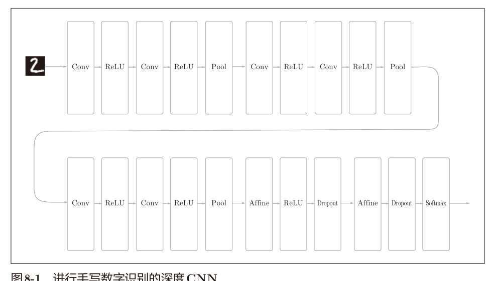

- 基于3×3的小型滤波器的卷积层。
- 激活函数是ReLU。
- 全连接层的后面使用Dropout层。
- 基于Adam的最优化。
- 使用He初始值作为权重初始值。

作者的结果是0.62%错误率，已经是很高了。

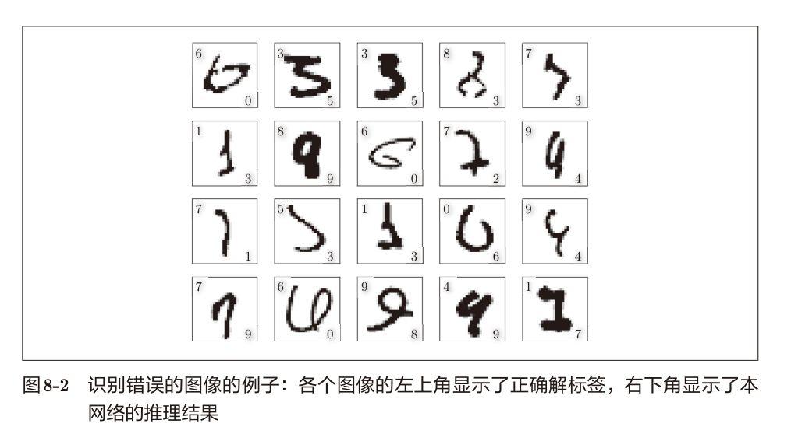

还展示了一些错误的例子

## 进一步提高精度

这里有一个MNIST的排行榜在What is the class of this image ?网站上显示的到现在好像没有怎么变嘛。

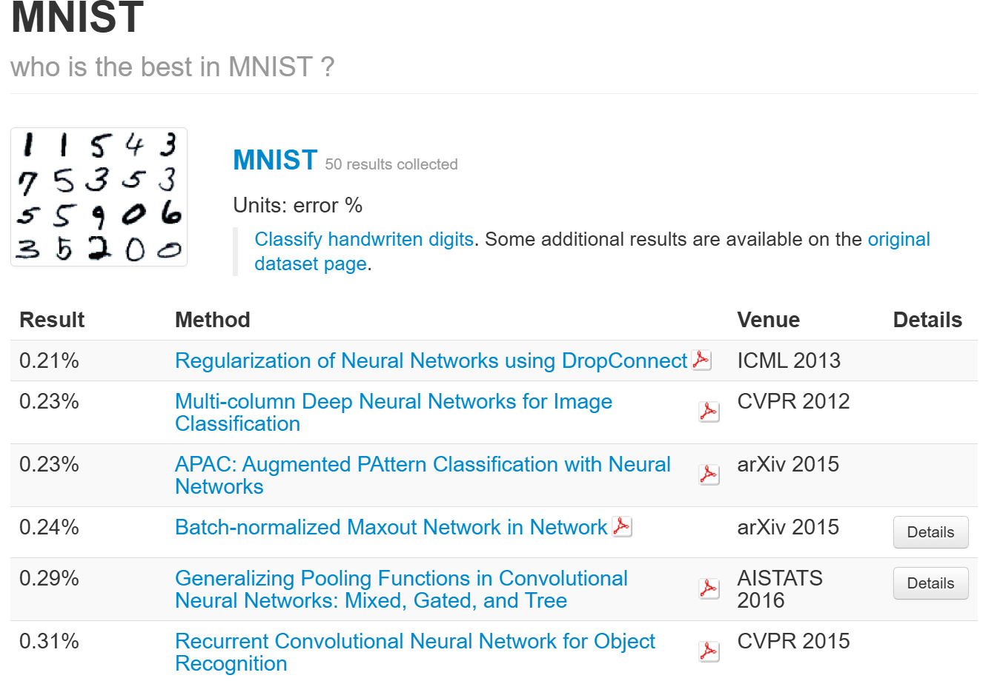

集成学习、学习率衰减我们之前了解过。

Data Augmentation（数据扩充）：Data Augmentation基于算法“人为地”扩充输入图像（训练图像）增加图像的数量。这在数据集的图像数量有限时尤其有效。

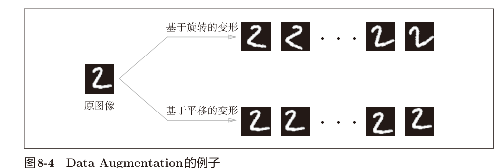

## 为什么加深层

不知道。一个原因就是减少网络的参数数量。

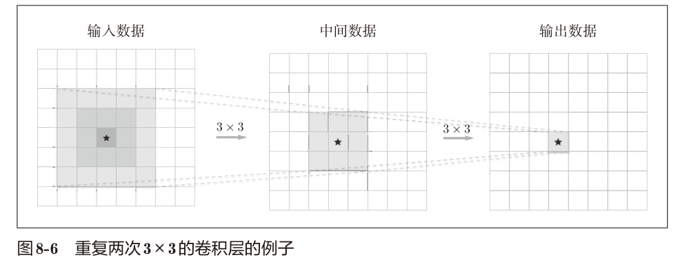

一个5×5=25的参数用两次3×3=2×3×3=18表示。

另外加深网络就可以分解需要学习的问题。简单的网络需要一下子理解很多特征，而深层次的网络一开始只要学习简单的特征，然后抽象到复杂。

# 小历史

大规模图像识别大赛ILSVRC可以看出深度学习的发展。

## ImageNet

ImageNet是拥有超过100万张图像的数据集，2012年之后就是深度学习的天下了。AlexNet作为始祖，ResNet更进一步，

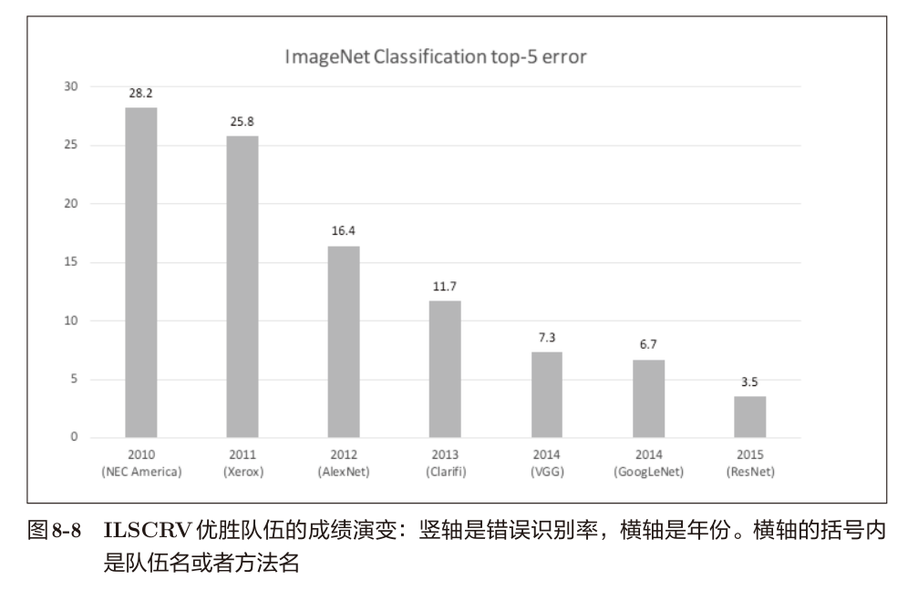

## VGG

VGG 是由卷积层和池化层构成的基础的 CNN。

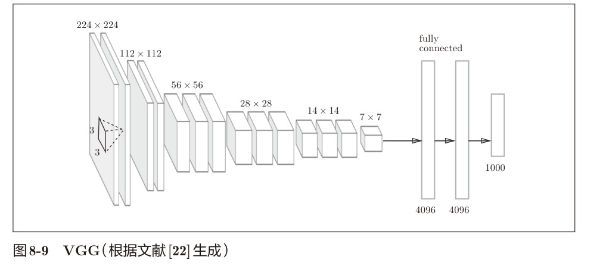

有16层，重复进行“卷积层重叠2次到4次，再通过池化层将大小减半”的处理，最后经由全连接层输出结果。

结构简单好看

## GoogLeNet

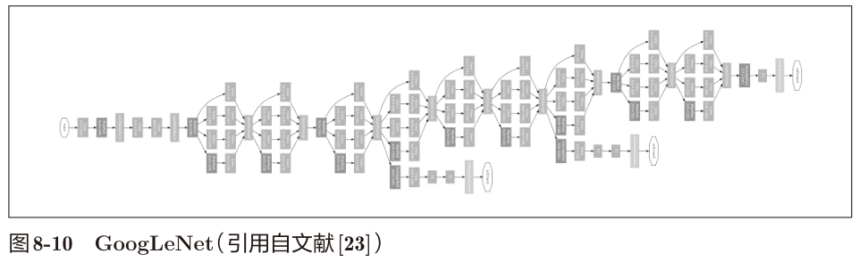

看着是真滴复杂。不仅在纵向上有深度，在横向上也有深度（广度）。

Inception结构使用了多个大小不同的滤波器（和池化），最后再合并它们的结果。

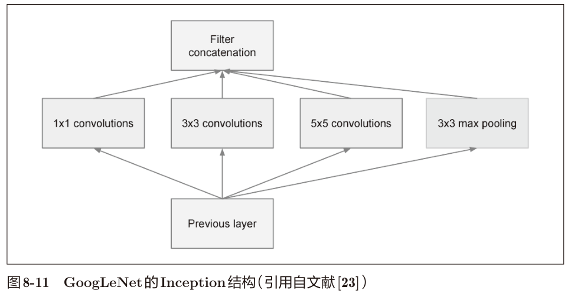

## ResNet

过度加深层的话，很多情况下学习将不能顺利进行，导致最终性能不佳。

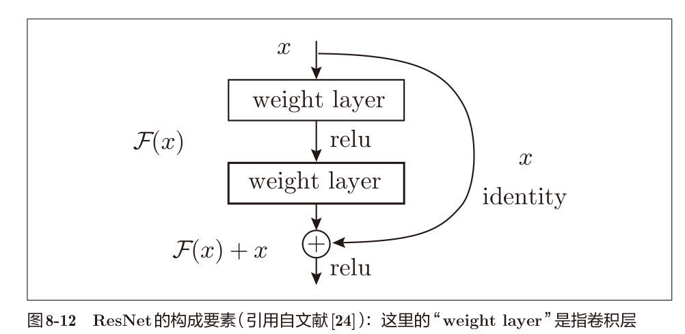

导入了“快捷结构”，原来的2层卷积层的输出F(x)变成了F(x) + x

反向传播时信号可以无衰减地传递。

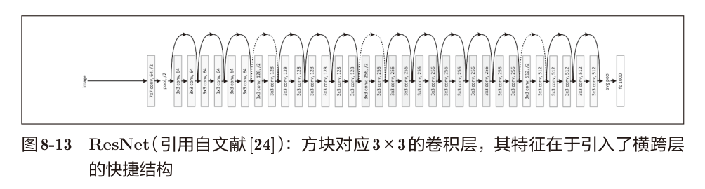

这样就可以加深层了。

> 迁移学习：将学习完的权重（的一部分）复制到其他神经网络，进行再学习（fine tuning）。迁移学习在手头数据集较少时非常有效。

# 深度学习高速化

## GPU加速

要加速就得用GPU计算

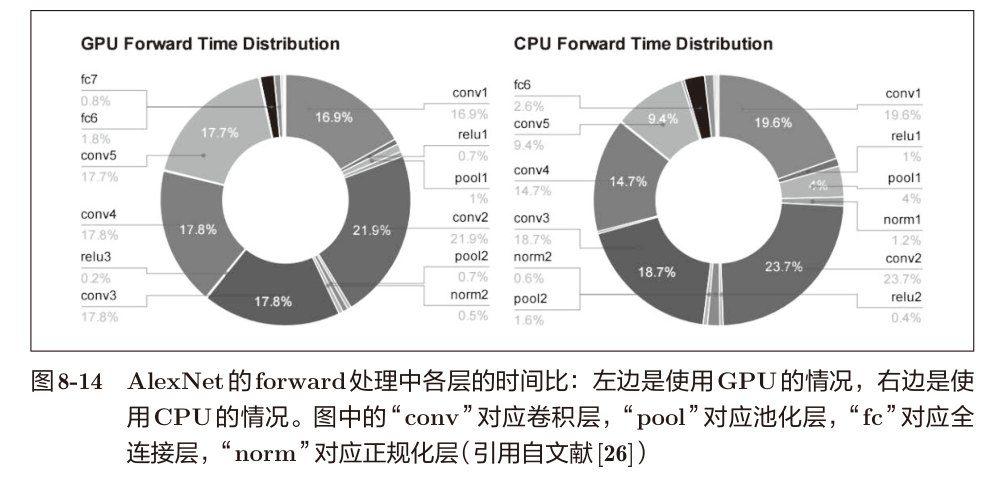

深度学习需要大量简单重复的累加运算，这点GPU更适合（CPU更适合连续复杂计算）

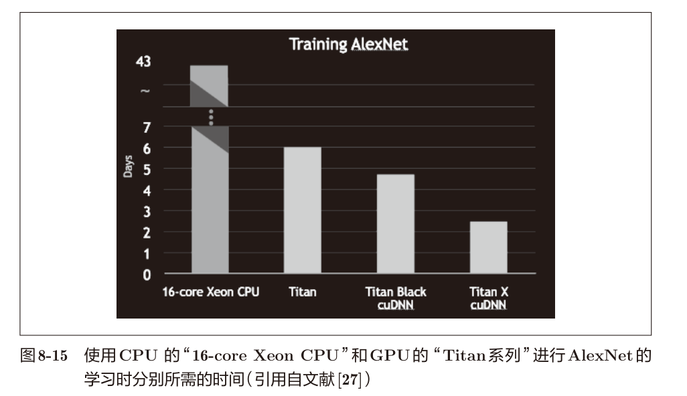

## 分布式学习

深度学习需要不断试错，缩短学习时间是刚需。我们需要尽快看到结果。一个好的GPU太贵了。在多个GPU上分布式学习也不错。

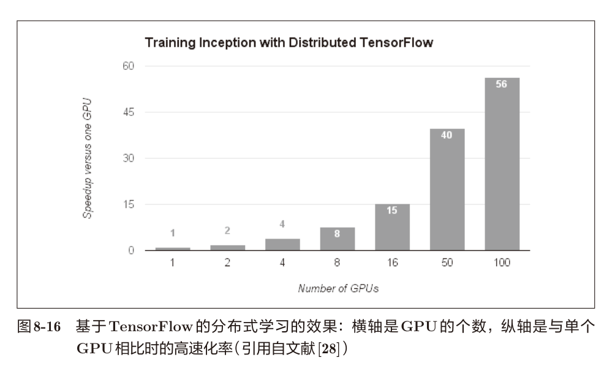

100个GPU可以提高56倍

## 运算精度

权重参数和中间数据放在内存当中。超过GPU的总线带宽，也会影响速度。

我们计算的时候一般都是64位或32位浮点数，这样计算的误差比较小。但内存消耗比较大。

然而神经网络其实并不太需要精度很高的位数。只要网络具有稳健性即可。

32是单精度，64是双精度，那么16位就是半精度。英伟达的下一代GPU就支持半精度浮点数运算。

虽然numpy也提供半精度浮点数，但是这只是存储，计算还是根据运算器的精度来的。用了半精度，识别准确率也不会下降。

# 应用案例

手写数字识别，是类别分类问题。还有好多其他应用案例

## 物体检测

确定物体位置，并进行分类。

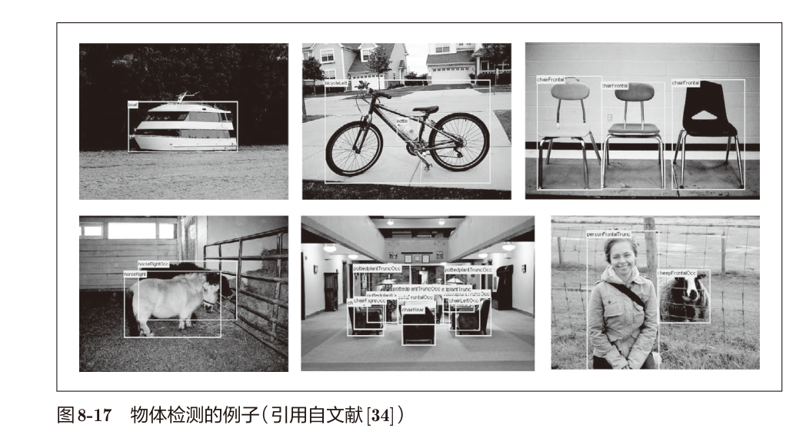

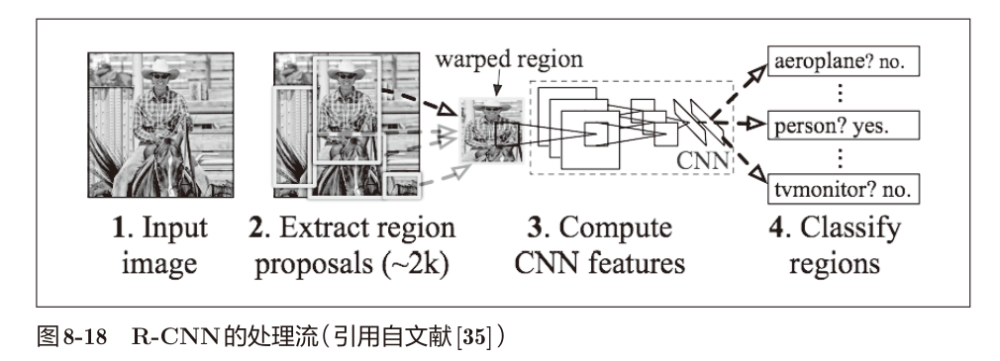

一个叫做R-CNN的方法的处理流程。先找出物体的区域，再对提取区域应用CNN。

## 图像分割

在像素水平对图像进行分类。

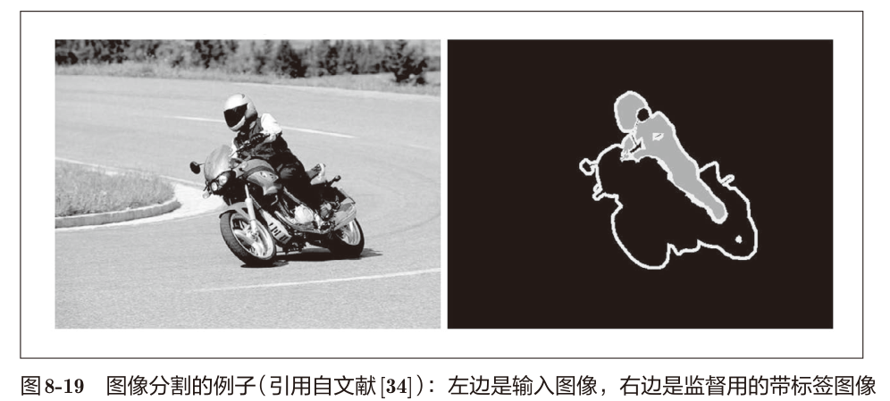

FCN即“全部由卷积层构成的网络”，FCN将全连接层替换成发挥相同作用的卷积层。

只由卷积层构成的网络中，空间容量可以保持原样直到最后的输出。

> 其实卷积层也可以全连接，本身卷积层就是滤波器内的全连接，那我只要把滤波器调到最大不就完事了吗。批数量设置为输出数量就完事了。这样就实现了全卷积的结构。

## 生成图像标题

这个是CV和NLP的融合研究。

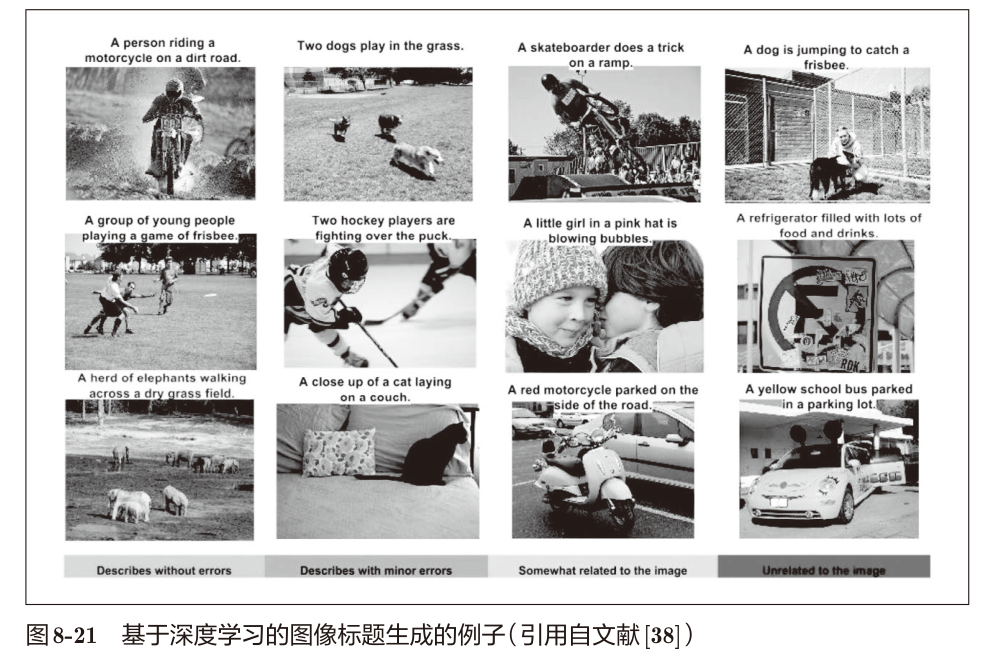

NIC（NeuralImage Caption）的模型。NIC由深层的CNN和处理自然语言的RNN（Recurrent Neural Network）构成。

这就涉及多模态领域了

> 那这个时代已经是大模型的时代了。

# 未来展望

其实我现在已经处于未来了。

## 图像风格变换

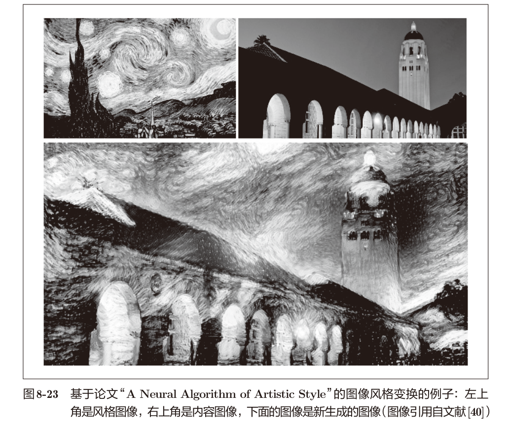

## 图像生成

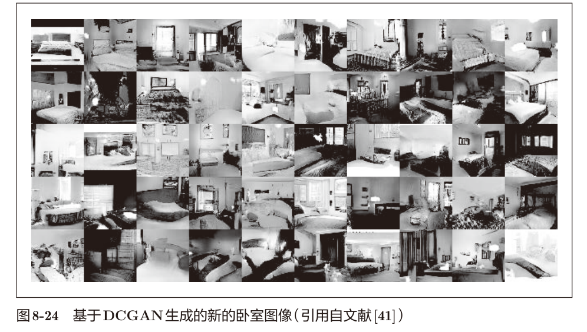

## 自动驾驶

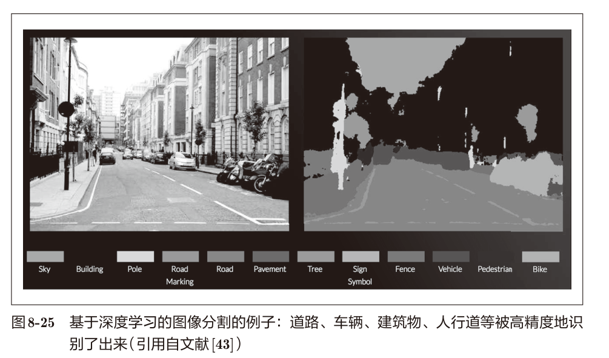

这里其实还是高精度图像分割的应用

## 强化学习

在摸索中自主学习，不是监督学习了。

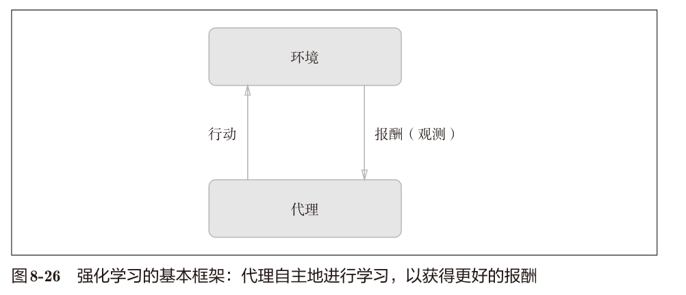

AlphaGo用的即使强化学习